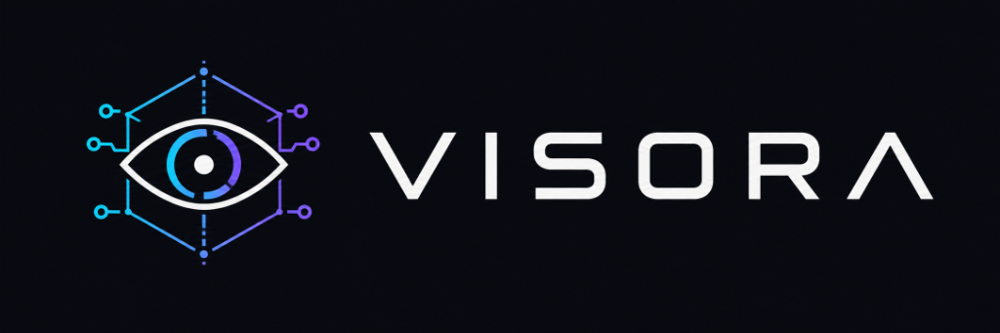

<p align="center">
  
</p>

# Visora 👁️

Visora is a high-level Model Context Protocol (MCP) server designed to interface AI agents with the Unity Editor via an HTTP bridge (AnkleBreaker plugin). It exposes specialized, typed tools for camera rendering, viewport projection, visual diagnostics, safe scene transactions, skinned mesh analysis, animation clip inspection, and async task queueing.

---

## 📚 Documentation

- 📖 **[Agent Workflow Guide & Practical Recipes](docs/AGENT_WORKFLOWS.md)** — Step-by-step diagnostic recipes, camera projections, rig/animation debugging, and agent safety rules.
- ⚙️ **[Setup & Integration Guide](docs/SETUP_GUIDE.md)** — Setup instructions for Unity Editor, AnkleBreaker, `.env` config, and client setups (Claude Desktop, Cursor, Antigravity, OpenCode).
- 🗺️ **[Roadmap & Progress](docs/ROADMAP.md)** — Current status and milestones.

---

## 🚀 Stack

- **Python 3.10+**
- **FastMCP (mcp)** — MCP server framework
- **HTTPX** — Async HTTP client with automatic port discovery and retry backoff
- **Pydantic v2 + pydantic-settings** — Typed config, validation, and structured tool output schemas
- **Asyncio** — Asynchronous task loop & non-blocking ticket polling

---

## 📂 Project Structure

```
visora/
├── backend/
│   ├── __init__.py
│   ├── app.py             # FastMCP application instance
│   ├── server.py          # MCP server entrypoint
│   ├── config.py          # Centralized Pydantic settings
│   ├── bridge.py          # HTTP bridge client with multi-port failover
│   ├── tools/
│   │   ├── vision/        # screenshots, camera rendering, viewport projection, video
│   │   ├── animation/     # clip curve inspection, skeleton mapping, pose sampling
│   │   ├── scene/         # safe transactions, playmode lifecycle, compilation check
│   │   ├── mesh/          # skinned mesh diagnostics, bone binding & bound audit
│   │   └── bridge/        # health check, port scan, queue ticket polling
│   └── schemas/           # Pydantic output models for every tool
├── docs/
│   ├── AGENT_WORKFLOWS.md # Agent recipes, workflows, and safety rules
│   ├── SETUP_GUIDE.md     # Installation and MCP client configuration
│   └── ROADMAP.md         # Roadmap & feature matrix
├── tests/                 # Unit and integration test suites
├── pyproject.toml
└── .env.example
```

---

## 🛠️ Getting Started

### Installation

```bash
# Using uv (recommended)
uv pip install -e .

# Or using pip
pip install -e .
```

### Environment Configuration

Copy the `.env.example` file to `.env`:

```bash
cp .env.example .env
```

### Running the MCP Server

```bash
# Direct module execution
uv run python -m backend.server

# Or package CLI
uv run visora
```

---

## 🧰 Available MCP Tools

| Category | Tool | Description |
| :--- | :--- | :--- |
| **Vision** | `unity_screenshot` | High-resolution capture from scene or specified camera |
| | `unity_render_camera` | Isolated camera render texture with custom resolution/HDR/MSAA |
| | `unity_project_world_points` | Project 3D points into camera viewport and screen pixels |
| | `unity_detect_visual_issues` | Check clipping planes, off-screen bounds, and occlusion |
| | `unity_record_video` | Record viewport frame sequence |
| **Scene** | `unity_get_scene_state` | Retrieve active scene hierarchy, cameras, lights, and play mode |
| | `unity_safe_transaction` | Execute C# modifications protected by Undo registration |
| | `unity_execute_code` | Run arbitrary C# snippet with structured return |
| | `unity_play_mode` | Safely control Play / Pause / Stop mode |
| | `unity_save_scene` | Persist scene changes (guarded against Play Mode) |
| | `unity_compilation_errors` | Query script compilation errors/warnings |
| **Animation** | `unity_inspect_skeleton` | Inspect bone hierarchies with fuzzy matching and MMD support |
| | `unity_inspect_animation_clip` | Audit curve types, root motion, and scale anomalies |
| | `unity_sample_animation` | Sample pose and bone transforms at timestamp `t` |
| **Mesh** | `unity_diagnose_skinned_mesh` | Audit bounds, null bones, bindposes, and submesh materials |
| **Bridge** | `unity_ping` | Ping bridge endpoint |
| | `unity_bridge_health` | Multi-port diagnostic and scan |
| | `unity_queue_status` | Check async queue ticket progress |
| | `unity_wait_for_ticket` | Non-blocking async loop for long operations |
