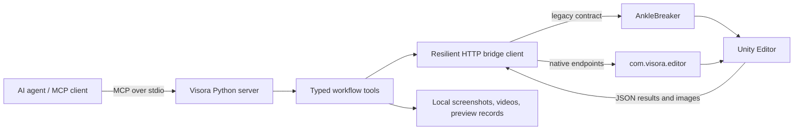

<p align="center">
  
</p>

# 👁️ Visora

<p align="center">
  <strong>A high-level Model Context Protocol (MCP) server for Unity Editor.</strong><br>
  <em>Empowering AI agents to observe, diagnose, mutate, and verify live Unity scenes with typed safety.</em>
</p>

<p align="center">
  <a href="https://www.python.org/"></a>
  <a href="https://unity.com/"></a>
  <a href="https://modelcontextprotocol.io/"></a>
  <a href="https://github.com/AmaLS367/Visora/actions"></a>
  <a href="LICENSE"></a>
  <a href="https://docs.astral.sh/ruff/"></a>
</p>

---

Visora is a high-level [Model Context Protocol](https://modelcontextprotocol.io/) server for Unity Editor. It gives AI agents typed tools for seeing a scene, understanding its state, changing it safely, and verifying the result.

Raw editor scripting is powerful, but it is a poor interface for an autonomous agent: the agent has to invent C#, interpret unstructured logs, guess whether the camera can see an object, and clean up every temporary state change itself. Visora turns those recurring jobs into explicit workflows with validated inputs, compact structured outputs, safety checks, and visual artifacts.

## 🎯 Why Visora Exists

An agent working in Unity needs more than remote code execution. It needs to answer concrete diagnostic questions:

- ❓ Is the bridge unavailable, or is Unity only recompiling scripts?
- ❓ Is an object missing, outside the camera frustum, unlit, or behind the camera?
- ❓ Is a broken character caused by mesh bounds, bone bindings, the Avatar, or the animation clip?
- ❓ Did an edit actually improve motion over time, or does one screenshot only look plausible?
- ❓ Can a scene or clip mutation be undone if compilation or execution fails?

Visora makes these distinctions part of the tool contract. Its core operating loop is:

```text
🔍 Inspect State  ➔  🩺 Diagnose  ➔  🛡️ Mutate Safely  ➔  👁️ Verify Evidence  ➔  ✅ Keep / ↩️ Restore
```

<p align="center">
  
</p>
<p align="center"><em>Visora turns raw editor access into an inspect, act, and verify workflow.</em></p>

## ✨ Key Capabilities

- 👁️ **Visual Inspection & Lookdev** — Scene cameras, neutral diagnostic lighting, framing calculations, and viewport projections.
- 📐 **Framing & Viewport Projection** — Camera inventory, frustum diagnostics, and world-to-viewport coordinate mapping.
- 🎬 **Animation Analysis & Metrics** — AnimationClip inspection, exact-time sampling, preview videos, motion metrics, and reproducible comparison records.
- 🦴 **Skeleton & Kinematics** — Skeleton mapping, Humanoid Avatar validation, two-bone IK solver, gaze tracking, contact analysis, and curve discontinuity detection.
- 🛡️ **Undo-Aware Transactions** — Atomic scene and animation transactions with explicit rollback and recovery paths.
- 📦 **Asset Discovery & Quarantine** — Online asset discovery (Sketchfab, Poly Pizza), quarantined downloads, archive validation, Unity import inspection, and scene instantiation.
- 🔌 **Resilient HTTP Transport** — Multi-port discovery, bridge flavor selection (native vs legacy), domain-reload recovery, and typed retry hints.
- ⚡ **Bundled Native Companion** — Native Unity package (`com.visora.editor`) plus full compatibility with the legacy AnkleBreaker bridge.

The current MCP surface contains **46 registered tools**. The generated source-of-truth catalog is in [Agent workflows](docs/AGENT_WORKFLOWS.md#tool-catalog).

## 🧩 How It Fits Together



The Python process is the agent-facing product surface. Unity remains authoritative for scene, asset, animation, and rendering state. See [Architecture](docs/backend/README.md) for the complete request lifecycle and module boundaries.

## 🚀 Quick Start

### 1️⃣ Install the Python Server

From PyPI as an isolated command-line tool:

```bash
uv tool install visora
```

For development from this repository:

```bash
git clone https://github.com/AmaLS367/Visora.git
cd Visora
uv sync --locked --all-extras
```

Visora requires Python 3.10 or newer. Project and installation commands use `uv`.

### 2️⃣ Choose a Unity Bridge

- **Native bridge (Recommended):** install `unity-package/` as `com.visora.editor`. The current package requires Unity 6 (`6000.0`) or newer and exposes the complete optimized feature set.
- **Legacy bridge:** keep an existing AnkleBreaker installation and use Visora as a high-level compatibility wrapper. Unity-version support is determined by that bridge.

The Python default is `UNITY_BRIDGE_MODE=legacy`; set `native` explicitly when using the bundled package. `auto` accepts either and prefers a matching legacy bridge when both are running.

### 3️⃣ Configure and Run

```bash
cp .env.example .env
# Set UNITY_BRIDGE_MODE=native when using com.visora.editor.
uv run visora
```

Visora communicates with its MCP client over standard input/output. A repository-based client configuration looks like this:

```json
{
  "mcpServers": {
    "visora": {
      "command": "uv",
      "args": ["run", "--directory", "/absolute/path/to/Visora", "visora"],
      "env": {
        "UNITY_BRIDGE_MODE": "native"
      }
    }
  }
}
```

After connecting, call `get_bridge_status`, then `get_editor_state`. Do not begin with a scene mutation.

For platform-specific installation, Docker networking, Unity Package Manager steps, and troubleshooting, read the [Setup guide](docs/SETUP_GUIDE.md).

## 📚 Documentation Hub

Explore the full documentation suite organized by workflow and architectural domain:

| Domain | Guide | Description |
| :--- | :--- | :--- |
| 🧭 **Overview** | [Documentation Index](docs/README.md) | Central hub and roadmap of all documentation resources. |
| 💡 **Philosophy** | [Concepts & Philosophy](docs/CONCEPTS.md) | The problem model, design principles, and intentional limits. |
| 🛠️ **Installation** | [Setup Guide](docs/SETUP_GUIDE.md) | Python, Unity, MCP client, Docker, verification, and recovery. |
| 🤖 **Agent Recipes** | [Agent Workflows](docs/AGENT_WORKFLOWS.md) | The complete 46-tool MCP catalog and task-oriented recipes. |
| 🏗️ **Architecture** | [Backend Architecture](docs/backend/README.md) | Runtime layers, module boundaries, and request lifecycle. |
| 🌐 **Networking** | [Bridge & Failure Semantics](docs/backend/BRIDGE.md) | Discovery, native/legacy dispatch, retries, and reloads. |
| 📐 **Data Contracts** | [Tools & Schemas](docs/backend/TOOLS_AND_SCHEMAS.md) | MCP registration, Pydantic contracts, and context compaction. |
| 🛡️ **Scene Integrity** | [State & Safety](docs/backend/STATE_AND_SAFETY.md) | Edit/Play Mode, Undo stacks, saving rules, and state cleanup. |
| 📦 **Asset Handling** | [Asset Pipeline](docs/backend/ASSET_PIPELINE.md) | Quarantine staging, SSRF defense, archive extraction, and import. |
| 💻 **Development** | [Development Guide](docs/backend/DEVELOPMENT.md) | Repository workflow, tests, validation gates, and conventions. |
| 🗺️ **Planning** | [Roadmap](docs/ROADMAP.md) & [Changelog](docs/CHANGELOG.md) | Release milestones, historical changes, and future plans. |

## 📁 Project Layout

```text
backend/
  app.py                 MCP server behavior and agent instructions
  server.py              process entrypoint and tool registration imports
  config.py              centralized Pydantic settings
  bridge/                HTTP transport, discovery, recovery, typed exceptions
  tools/                 bridge, scene, vision, animation, mesh, and asset workflows
  schemas/               Pydantic input/output vocabulary
unity-package/
  Editor/Core/           HTTP server, router, main-thread dispatcher, settings
  Editor/Services/       Unity-native workflow implementations
  Tests/Editor/          Unity EditMode integration tests
docs/                    user, agent, architecture, and contributor documentation
skills/                  optional agent workflow skills
tests/                   Python unit and integration tests
scripts/                 catalog, distribution, Python/Unity validation helpers
```

## ⚠️ Important Operating Boundaries

> [!IMPORTANT]
> **Live Unity Companion**: Visora controls a live Unity Editor instance; it is not a standalone headless replacement for Unity.

> [!WARNING]
> **Localhost Loopback Only**: The native bridge listens exclusively on loopback (`127.0.0.1`). Never expose this port directly to an untrusted network.

> [!NOTE]
> **Safe Transactions & Undo**: `safe_transaction` improves recovery but cannot make arbitrary C# intrinsically safe. Script operations must register affected Unity objects with the Undo system.

> [!CAUTION]
> **Evidence over Assumed Success**: A successful HTTP status (`success=true`) confirms call completion, not creative or aesthetic correctness. Always inspect the returned evidence, motion metrics, and visual artifacts.

> [!TIP]
> **glTF / GLB Importer Requirement**: `.gltf` and `.glb` files require a glTF importer package installed in the target Unity project; vanilla Unity does not provide one natively.

## 🤝 Contributing

See [CONTRIBUTING.md](CONTRIBUTING.md) and the [backend development guide](docs/backend/DEVELOPMENT.md). Visora intentionally does not keep internal Python compatibility shims: when an internal interface changes, update every caller, test, and document to the new canonical API.

## 📜 License

Copyright 2026 Ama.

Licensed under the [Apache License, Version 2.0](LICENSE).

