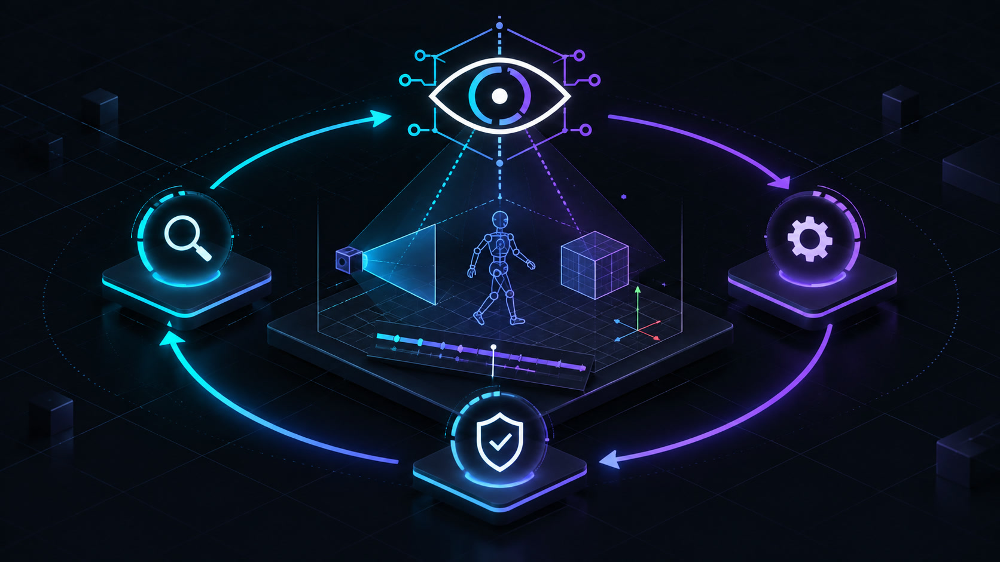
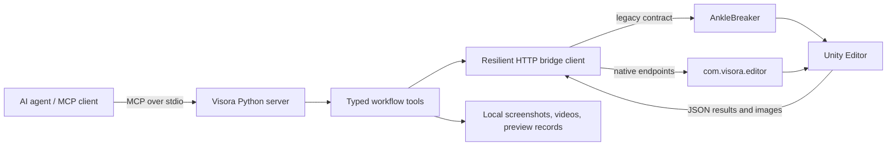

<p align="center">
  
</p>

# Visora

Visora is a high-level [Model Context Protocol](https://modelcontextprotocol.io/) server for Unity Editor. It gives AI agents typed tools for seeing a scene, understanding its state, changing it safely, and verifying the result.

Raw editor scripting is powerful, but it is a poor interface for an autonomous agent: the agent has to invent C#, interpret unstructured logs, guess whether the camera can see an object, and clean up every temporary state change itself. Visora turns those recurring jobs into explicit workflows with validated inputs, compact structured outputs, safety checks, and visual artifacts.

## Why Visora exists

An agent working in Unity needs more than remote code execution. It needs to answer questions such as:

- Is the bridge unavailable, or is Unity only recompiling scripts?
- Is an object missing, outside the camera frustum, unlit, or behind the camera?
- Is a broken character caused by mesh bounds, bone bindings, the Avatar, or the animation clip?
- Did an edit actually improve motion over time, or does one screenshot only look plausible?
- Can a scene or clip mutation be undone if compilation or execution fails?

Visora makes these distinctions part of the tool contract. Its core loop is:

```text
inspect state -> diagnose -> mutate safely -> verify visually and structurally -> keep or restore
```

<p align="center">
  
</p>
<p align="center"><em>Visora turns raw editor access into an inspect, act, and verify workflow.</em></p>

## What it provides

- Visual inspection through scene cameras and neutral diagnostic lighting.
- Camera inventory, framing diagnostics, and world-to-viewport projection.
- AnimationClip inspection, exact-time sampling, preview videos, motion metrics, and reproducible comparison records.
- Skeleton, Humanoid Avatar, contact, IK, gaze, self-intersection, and skinned-mesh diagnostics.
- Undo-aware scene and animation transactions with explicit recovery paths.
- Online asset discovery, quarantined downloads, archive validation, Unity import inspection, and scene instantiation.
- Resilient HTTP transport with multi-port discovery, bridge flavor selection, domain-reload recovery, and typed retry hints.
- A bundled native Unity package plus compatibility with the AnkleBreaker bridge.

The current MCP surface contains **46 registered tools**. The generated source-of-truth catalog is in [Agent workflows](docs/AGENT_WORKFLOWS.md#tool-catalog).

## How it fits together



The Python process is the agent-facing product surface. Unity remains authoritative for scene, asset, animation, and rendering state. See [Architecture](docs/backend/README.md) for the complete request lifecycle and module boundaries.

## Quick start

### 1. Install the Python server

From PyPI as an isolated command-line tool:

```bash
uv tool install visora
```

For development from this repository:

```bash
git clone https://github.com/AmaLS367/Visora.git
cd Visora
uv sync --locked --all-extras
```

Visora requires Python 3.10 or newer. Project and installation commands use `uv`.

### 2. Choose a Unity bridge

- **Native bridge:** install `unity-package/` as `com.visora.editor`. The current package requires Unity 6 (`6000.0`) or newer and exposes the complete optimized feature set.
- **Legacy bridge:** keep an existing AnkleBreaker installation and use Visora as a high-level compatibility wrapper. Unity-version support is determined by that bridge.

The Python default is `UNITY_BRIDGE_MODE=legacy`; set `native` explicitly when using the bundled package. `auto` accepts either and prefers a matching legacy bridge when both are running.

### 3. Configure and run

```bash
cp .env.example .env
# Set UNITY_BRIDGE_MODE=native when using com.visora.editor.
uv run visora
```

Visora communicates with its MCP client over standard input/output. A repository-based client configuration looks like this:

```json
{
  "mcpServers": {
    "visora": {
      "command": "uv",
      "args": ["run", "--directory", "/absolute/path/to/Visora", "visora"],
      "env": {
        "UNITY_BRIDGE_MODE": "native"
      }
    }
  }
}
```

After connecting, call `get_bridge_status`, then `get_editor_state`. Do not begin with a scene mutation.

For platform-specific installation, Docker networking, Unity Package Manager steps, and troubleshooting, read the [Setup guide](docs/SETUP_GUIDE.md).

## Documentation

Start at the [documentation index](docs/README.md). The main guides are:

- [Concepts and philosophy](docs/CONCEPTS.md) — the problem model, design principles, benefits, and intentional limits.
- [Setup guide](docs/SETUP_GUIDE.md) — Python, Unity, MCP client, Docker, verification, and recovery.
- [Agent workflows](docs/AGENT_WORKFLOWS.md) — the generated tool catalog and task-oriented recipes.
- [Backend architecture](docs/backend/README.md) — runtime layers, module ownership, and request lifecycle.
- [Bridge and failure semantics](docs/backend/BRIDGE.md) — discovery, native/legacy dispatch, retries, reloads, and errors.
- [Tools and schemas](docs/backend/TOOLS_AND_SCHEMAS.md) — MCP registration, result contracts, compact responses, and extension rules.
- [State and safety](docs/backend/STATE_AND_SAFETY.md) — Edit/Play Mode, Undo, rollback, saving, and temporary-state restoration.
- [Asset pipeline](docs/backend/ASSET_PIPELINE.md) — providers, quarantine, SSRF/archive defenses, import, and verification.
- [Development guide](docs/backend/DEVELOPMENT.md) — repository workflow, tests, generated docs, and contribution checklist.
- [Roadmap](docs/ROADMAP.md) and [changelog](docs/CHANGELOG.md) — release history and planned work.

## Project layout

```text
backend/
  app.py                 MCP server behavior and agent instructions
  server.py              process entrypoint and tool registration imports
  config.py              centralized Pydantic settings
  bridge/                HTTP transport, discovery, recovery, typed exceptions
  tools/                 bridge, scene, vision, animation, mesh, and asset workflows
  schemas/               Pydantic input/output vocabulary
unity-package/
  Editor/Core/           HTTP server, router, main-thread dispatcher, settings
  Editor/Services/       Unity-native workflow implementations
  Tests/Editor/          Unity EditMode integration tests
docs/                    user, agent, architecture, and contributor documentation
skills/                  optional agent workflow skills
tests/                   Python unit and integration tests
scripts/                 catalog, distribution, Python/Unity validation helpers
```

## Important operating boundaries

- Visora controls a live Unity Editor; it is not a headless replacement for Unity.
- The native bridge listens on loopback only. Do not expose it directly to an untrusted network.
- `safe_transaction` improves recovery but cannot make arbitrary C# intrinsically safe. Code must still register affected Unity objects with Undo.
- A successful HTTP request is not sufficient proof of a successful creative change. Inspect the typed result and verify the scene, clip, or artifact.
- `.gltf` and `.glb` require a glTF importer in the target Unity project; vanilla Unity does not provide one.

## Contributing

See [CONTRIBUTING.md](CONTRIBUTING.md) and the [backend development guide](docs/backend/DEVELOPMENT.md). Visora intentionally does not keep internal Python compatibility shims: when an internal interface changes, update every caller, test, and document to the new canonical API.

## License

Copyright 2026 Ama.

Licensed under the [Apache License, Version 2.0](LICENSE).
