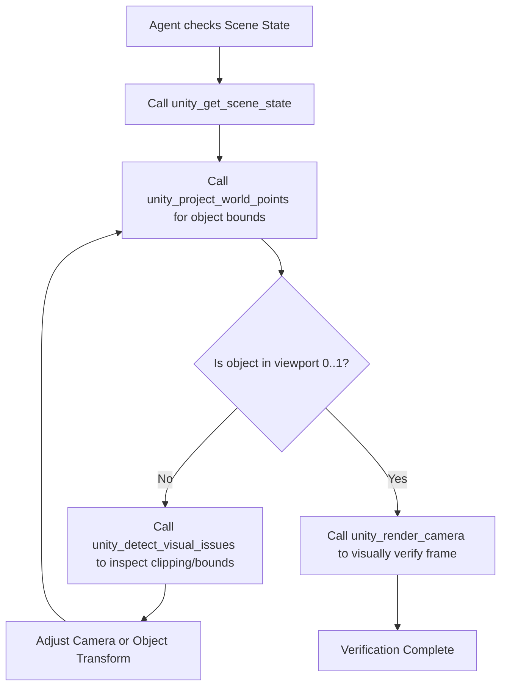
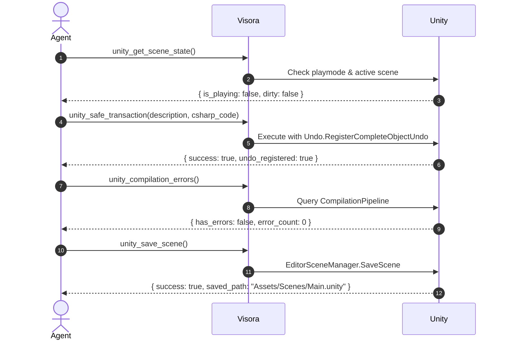

# Visora — Agent Workflow Guide & Practical Recipes 👁️

This guide is designed for **AI agents** and **engineers building agentic systems** with Unity Editor. Visora provides a typed, safe, and structured Model Context Protocol (MCP) layer on top of Unity Editor via the AnkleBreaker HTTP bridge.

---

## 📑 Table of Contents

1. [Architectural Principles for Agents](#1-architectural-principles-for-agents)
2. [Core Tool Catalog](#2-core-tool-catalog)
   - [Vision & Camera Intelligence](#vision--camera-intelligence)
   - [Scene State & Safe Execution](#scene-state--safe-execution)
   - [Animation & Skeleton Diagnostics](#animation--skeleton-diagnostics)
   - [Skinned Mesh & Geometry Diagnostics](#skinned-mesh--geometry-diagnostics)
   - [Bridge Health & Async Queue](#bridge-health--async-queue)
3. [Practical Agent Workflows (Step-by-Step Recipes)](#3-practical-agent-workflows-step-by-step-recipes)
   - [Recipe 1: Visual Verification & Off-Screen Detection](#recipe-1-visual-verification--off-screen-detection)
   - [Recipe 2: Safe Scene Edit & Transaction Lifecycle](#recipe-2-safe-scene-edit--transaction-lifecycle)
   - [Recipe 3: Rig & Animation Inspection Workflow](#recipe-3-rig--animation-inspection-workflow)
   - [Recipe 4: Skinned Mesh Deformation Troubleshooting](#recipe-4-skinned-mesh-deformation-troubleshooting)
   - [Recipe 5: Long-Running Tasks via Queue Tickets](#recipe-5-long-running-tasks-via-queue-tickets)
4. [Agent Safety Rules & Best Practices](#4-agent-safety-rules--best-practices)

---

## 1. Architectural Principles for Agents

When AI agents interact with game engines, raw C# script injection or unparsed console logs often lead to corrupted scenes, missed visual bugs, or silent failures. Visora solves this by enforcing:

1. **Typed Structured Outputs**: Every tool returns Pydantic-validated JSON with explicit fields (`success`, `errors`, `warnings`, `data`). No raw string scraping required.
2. **Visual Feedback Loop**: Agents can inspect camera viewpoints, project 3D points to 2D viewport space, and check rendering state directly.
3. **Scene Preservation**: Safe transactions, Edit/Play mode awareness, and automated cleanup of temporary textures or sampling objects.
4. **Explicit Failure Diagnostics**: Unreachable bridge, Unity compilation locks, missing components, or null references return clear diagnostic error codes.

---

## 2. Core Tool Catalog

### Vision & Camera Intelligence

| Tool Name | Key Parameters | Return Model | Purpose |
| :--- | :--- | :--- | :--- |
| `unity_screenshot` | `camera_name`, `super_size`, `display_index` | `ScreenshotResult` | Captures high-res screenshot from Scene/Game view or specific camera. |
| `unity_render_camera` | `camera_name`, `width`, `height`, `use_hdr`, `use_msaa`, `post_process` | `CameraRenderResult` | Renders a specific Unity Camera to an isolated texture with exact resolution. |
| `unity_project_world_points` | `camera_name`, `points` (`[{"x":0,"y":0,"z":0}]`) | `ProjectionResult` | Projects 3D world coordinates into normalized viewport `[0,1]` and screen pixel coordinates. |
| `unity_detect_visual_issues` | `camera_name`, `target_object_name`, `points` | `VisualIssuesResult` | Analyzes clipping (near/far plane), off-screen bounding boxes, and camera occlusions. |
| `unity_record_video` | `camera_name`, `duration_sec`, `fps`, `width`, `height` | `VideoRecordResult` | Captures animated sequence / video clip of viewport actions. |

### Scene State & Safe Execution

| Tool Name | Key Parameters | Return Model | Purpose |
| :--- | :--- | :--- | :--- |
| `unity_get_scene_state` | `include_root_objects`, `include_cameras`, `include_lights` | `SceneStateResult` | Returns current active scene, play mode status, root objects hierarchy, and camera/light summaries. |
| `unity_safe_transaction` | `description`, `csharp_code`, `require_edit_mode` | `SafeTransactionResult` | Executes editor operations wrapped in an Undo group; prevents corrupting dirty scenes. |
| `unity_execute_code` | `code`, `timeout_seconds` | `CodeExecutionResult` | Executes arbitrary editor C# code snippet via bridge with structured output parsing. |
| `unity_play_mode` | `action` (`"play"` / `"pause"` / `"stop"`) | `PlayModeResult` | Safely toggles Unity Play/Pause/Stop mode with state confirmation. |
| `unity_save_scene` | `scene_path` (optional) | `SaveSceneResult` | Saves scene safely (guarded against saving during Play Mode). |
| `unity_compilation_errors` | — | `CompilationErrorsResult` | Returns active script compilation errors and warnings from Unity Editor. |

### Animation & Skeleton Diagnostics

| Tool Name | Key Parameters | Return Model | Purpose |
| :--- | :--- | :--- | :--- |
| `unity_inspect_animation_clip` | `clip_path` / `clip_name` | `AnimationClipInspectionResult` | Inspects clip bindings, frame rate, duration, looping, and flags dangerous root scale/position curves. |
| `unity_sample_animation` | `game_object_name`, `clip_name`, `time_seconds` | `AnimationSampleResult` | Samples GameObject pose at timestamp `t` and returns sampled bone transforms and warnings. |
| `unity_inspect_skeleton` | `root_object_name`, `search_bone_name`, `fuzzy_match` | `SkeletonHierarchyResult` | Inspects full hierarchy, detects duplicate/helper bones, and resolves MMD/humanoid bone chains. |

### Skinned Mesh & Geometry Diagnostics

| Tool Name | Key Parameters | Return Model | Purpose |
| :--- | :--- | :--- | :--- |
| `unity_diagnose_skinned_mesh` | `game_object_name` | `SkinnedMeshDiagnosticResult` | Diagnoses mesh deformation, root bone validity, bindpose counts, abnormal bounds, and submesh/material mismatch. |

### Bridge Health & Async Queue

| Tool Name | Key Parameters | Return Model | Purpose |
| :--- | :--- | :--- | :--- |
| `unity_ping` | — | `PingResult` | Quick ping check to verify Unity Editor bridge responsiveness. |
| `unity_bridge_health` | `scan_ports` (optional) | `BridgeHealthResult` | Comprehensive health report across primary, fallback, and scan ports. |
| `unity_queue_status` | `ticket_id` | `QueueStatusResult` | Checks progress/status of an async background operation. |
| `unity_wait_for_ticket` | `ticket_id`, `timeout_seconds`, `poll_interval_seconds` | `QueueTicketResult` | Non-blocking async loop waiting for ticket completion. |

---

## 3. Practical Agent Workflows (Step-by-Step Recipes)

### Recipe 1: Visual Verification & Off-Screen Detection

**Objective**: Verify that a newly placed or modified object (`"BossEnemy"`) is properly framed by the main camera and not occluded or clipped by near/far planes.



#### Step 1: Query camera and transform status
```json
// Tool: unity_project_world_points
{
  "camera_name": "Main Camera",
  "points": [
    {"x": 0.0, "y": 1.8, "z": 5.0},
    {"x": -0.5, "y": 0.0, "z": 5.0},
    {"x": 0.5, "y": 0.0, "z": 5.0}
  ]
}
```

#### Step 2: Analyze projection response
Look at `all_in_view` and `points[*].is_in_view`. If `is_behind_camera` is true or `viewport_x`/`viewport_y` are outside `[0.0, 1.0]`, reposition the camera or object.

#### Step 3: Render visual check
```json
// Tool: unity_render_camera
{
  "camera_name": "Main Camera",
  "width": 1280,
  "height": 720,
  "post_process": true
}
```

---

### Recipe 2: Safe Scene Edit & Transaction Lifecycle

**Objective**: Safely add or adjust components on a scene object, verify compilation, and persist changes without scene corruption.



#### Step 1: Pre-flight check
Call `unity_get_scene_state()` to ensure `is_playing == false`.

#### Step 2: Execute with transaction protection
```json
// Tool: unity_safe_transaction
{
  "description": "Add Light component to TargetObject",
  "require_edit_mode": true,
  "csharp_code": "var go = GameObject.Find(\"TargetObject\"); if (go != null) { Undo.AddComponent<Light>(go); }"
}
```

#### Step 3: Verify compilation & save
1. Call `unity_compilation_errors()` to ensure no compilation blocker exists.
2. Call `unity_save_scene()`.

---

### Recipe 3: Rig & Animation Inspection Workflow

**Objective**: Inspect imported FBX/MMD character animation clips, find required bones (including Japanese/fuzzy bone names), and sample keyframe poses.

#### Step 1: Audit Skeleton Hierarchy
```json
// Tool: unity_inspect_skeleton
{
  "root_object_name": "CharacterModel",
  "search_bone_name": "Hand_R",
  "fuzzy_match": true
}
```
*Tip*: Visora's skeleton inspector automatically resolves common rigging conventions, MMD D-bones (`左腕`, `右ひじ`), and helper chains.

#### Step 2: Inspect AnimationClip Curves
```json
// Tool: unity_inspect_animation_clip
{
  "clip_name": "Attack_Combo_01"
}
```
*Check output*:
- `has_root_motion_curves`: Does it unintentionally displace the root?
- `has_scale_curves`: Does it contain dangerous bone scaling?
- `warnings`: Any orphaned bone curves that don't match the avatar?

#### Step 3: Sample Pose at Specific Time
```json
// Tool: unity_sample_animation
{
  "game_object_name": "CharacterModel",
  "clip_name": "Attack_Combo_01",
  "time_seconds": 0.5
}
```

---

### Recipe 4: Skinned Mesh Deformation Troubleshooting

**Objective**: Diagnose why a 3D model looks distorted, exploded ("spiky vertices"), or invisible in the game view.

```json
// Tool: unity_diagnose_skinned_mesh
{
  "game_object_name": "CharacterMesh"
}
```

#### How to Interpret the Diagnostic Response:
- **`bone_binding_issues`**: Look for null bones in `bones[]` array or mismatch between `bindposes.Length` and bone count.
- **`abnormal_bounds`**: If `bounds.size` is enormous (e.g. `> 1000m`), vertices may be pulled to `(0,0,0)` due to unassigned weight indices.
- **`submesh_material_mismatch`**: If `submesh_count > material_count`, mesh parts will render pink or invisible.
- **`is_geometry_issue` vs `is_material_issue`**: Visora automatically categorizes whether the defect is mesh/bone related or shader/texture related.

---

### Recipe 5: Long-Running Tasks via Queue Tickets

**Objective**: Trigger a heavy operation (e.g., lightmap baking, asset bundle building, or mesh processing) and wait without timing out the MCP connection.

#### Step 1: Start async task and receive ticket
When executing long operations via code execution that return a `ticket_id`:
```json
{
  "ticket_id": "ticket_b7d8c12a"
}
```

#### Step 2: Poll status non-blockingly
```json
// Tool: unity_wait_for_ticket
{
  "ticket_id": "ticket_b7d8c12a",
  "timeout_seconds": 60.0,
  "poll_interval_seconds": 2.0
}
```

---

## 4. Agent Safety Rules & Best Practices

> [!CAUTION]
> **Never save during Play Mode**
> Any call to `unity_save_scene()` while `is_playing == true` will be rejected by Visora to prevent accidental scene asset corruption.

> [!WARNING]
> **Check Compilation Before Scene Operations**
> If scripts fail to compile in Unity (`unity_compilation_errors`), Unity Editor enters a locked domain state. Always resolve script errors first before invoking scene modifications.

### Agent Checklist Before Concluding a Task:
1. `unity_compilation_errors()` returns 0 errors.
2. `unity_get_scene_state()` confirms scene is in desired mode (Edit vs Play).
3. If changes were made, `unity_save_scene()` has been called in Edit Mode.
4. `unity_render_camera()` or `unity_screenshot()` was captured to visually confirm output.
