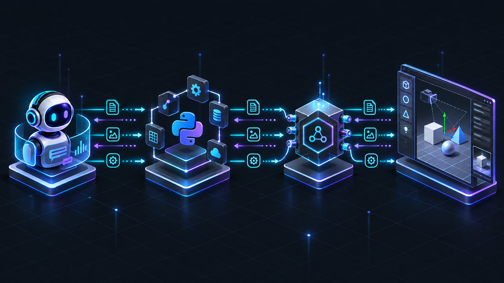

# 🛠️ Visora Setup and Operations Guide

> A step-by-step walkthrough to install the Python MCP server, pair it with the Unity Editor bridge, configure MCP clients, and verify end-to-end connectivity.

---

## 📦 Supported Component Versions

Visora consists of two independently versioned, collaborating components:

| Component | Current Version | Minimum Requirement | Notes |
| :--- | :---: | :--- | :--- |
| 🐍 **Python MCP Server (`visora`)** | `0.1.3` | Python 3.10+ | Central MCP orchestrator managed via `uv` |
| 🎮 **Native Package (`com.visora.editor`)** | `1.2.0` | Unity 6 (`6000.0`)+ | Recommended native C# companion package |
| 🔌 **Legacy Bridge (AnkleBreaker)** | — | Compatible Unity 2021+ | Supported in legacy compatibility mode |

<p align="center">
  
</p>
<p align="center"><em>The MCP client communicates with Python over stdio; Python talks to Unity over local HTTP.</em></p>

### 📋 Prerequisites Checklist

Before starting, ensure you have:
- [ ] An MCP-compatible client that supports standard input/output (`stdio`) servers (e.g. Claude Desktop, Cursor, Continue, Cline).
- [ ] Python 3.10+ with `uv` installed (`curl -LsSf https://astral.sh/uv/install.sh | sh`).
- [ ] An active Unity Editor project with either the bundled native package or AnkleBreaker bridge installed.
- [ ] Outbound internet access only when using online 3D asset search (Sketchfab / Poly Pizza).

---

## 1️⃣ Step 1: Install the Python Server

### Option A: Isolated CLI Tool (Recommended for Users)

Install `visora` directly as a standalone executable in an isolated environment:

```bash
uv tool install visora
visora
```

> [!TIP]
> Upgrade or remove the tool at any time with `uv tool upgrade visora` or `uv tool uninstall visora`.

### Option B: Local Repository Clone (For Contributors & Developers)

Clone the repository and install all dependencies:

```bash
git clone https://github.com/AmaLS367/Visora.git
cd Visora
uv sync --locked --all-extras
```

Launch the MCP server:

```bash
uv run visora
```

*(Equivalent to `uv run python -m backend.server`)*

> [!NOTE]
> The process communicates over `stdio`. When launched directly in a terminal, it will wait silently for JSON-RPC MCP messages. It does not launch a web dashboard or open a listening HTTP port.

---

## 2️⃣ Step 2: Install and Configure the Unity Bridge

Choose one primary bridge configuration. While `UNITY_BRIDGE_MODE=auto` can discover either, explicitly selecting your target mode avoids ambiguity.

### Option A: Native Unity Package (Recommended)

*Requires Unity 6 (`6000.0` or newer).*

1. In Unity Editor, open **Window > Package Manager**.
2. Click the **+** button in the upper left corner and select **Add package from git URL…**.
3. Enter the Git URL:

   ```text
   https://github.com/AmaLS367/Visora.git?path=unity-package
   ```

4. For local repository development, reference the local path in `Packages/manifest.json`:

   ```json
   {
     "dependencies": {
       "com.visora.editor": "file:../../Visora/unity-package"
     }
   }
   ```

5. Open **Window > Visora > Server Monitor** to verify the server status. By default, it automatically listens on port `7890` bound strictly to `127.0.0.1`.
6. Configure your environment:

   ```dotenv
   UNITY_BRIDGE_MODE=native
   UNITY_BRIDGE_PORT=7890
   ```

### Option B: Legacy AnkleBreaker Bridge

If using an older Unity version or an existing AnkleBreaker setup:
1. Ensure the AnkleBreaker bridge is active in the Unity project.
2. Set your environment to legacy mode:

   ```dotenv
   UNITY_BRIDGE_MODE=legacy
   ```

Visora will route requests through legacy C# statement-body execution while preserving identical typed MCP schemas.

---

## 3️⃣ Step 3: Configure Environment Variables

Copy the reference template into your project root:

```bash
cp .env.example .env
```

Key environment configurations:

```dotenv
# Bridge mode: native (Unity 6 package) or legacy (AnkleBreaker)
UNITY_BRIDGE_MODE=native
UNITY_BRIDGE_URL=http://127.0.0.1
UNITY_BRIDGE_PORT=7890

# Multi-port scanning candidates
UNITY_BRIDGE_PORTS_TO_SCAN=7890,7891,7892,7893

# Optional 3D asset search providers
SKETCHFAB_API_TOKEN=
POLY_PIZZA_API_KEY=
```

> [!IMPORTANT]
> `backend.config` loads `.env` relative to the server process's current working directory. Ensure your MCP client launches Visora from the repository root or passes settings directly via its `env` block.

---

## 4️⃣ Step 4: Configure Your MCP Client

### 🖥️ Claude Desktop / Cursor / Cline Configuration

#### Connecting to a Cloned Repository

```json
{
  "mcpServers": {
    "visora": {
      "command": "uv",
      "args": [
        "run",
        "--directory",
        "/absolute/path/to/Visora",
        "visora"
      ],
      "env": {
        "UNITY_BRIDGE_MODE": "native",
        "UNITY_BRIDGE_URL": "http://127.0.0.1"
      }
    }
  }
}
```

#### Connecting to a Global `uv tool` Installation

```json
{
  "mcpServers": {
    "visora": {
      "command": "visora",
      "args": [],
      "env": {
        "UNITY_BRIDGE_MODE": "native"
      }
    }
  }
}
```

> [!TIP]
> If your client fails to find `uv` or `visora`, specify the full absolute binary path (e.g. `/home/user/.cargo/bin/uv` or `/home/user/.local/bin/visora`). Always restart your MCP client after updating its configuration file.

---

## 5️⃣ Step 5: Verify the Connection

Once the Unity project has finished compiling, verify the connection by asking the agent to perform the following baseline checks:

1. 🔍 `get_bridge_status(scan_all_ports=true)` ➔ verify `connected=true` and confirm the `active_port`.
2. 🩺 `get_editor_state(wait=true)` ➔ verify `success=true`, `is_idle=true`, and check the active scene.
3. 📐 `list_scene_cameras` ➔ inspect available scene cameras.
4. 📸 `screenshot(width=640, height=360)` ➔ take a test diagnostic screenshot.

> [!CAUTION]
> Never initiate your first connection test with a scene mutation. Always start with read-only inspection.

---

## ⚙️ Comprehensive Configuration Reference

### 🌐 Bridge & Network Transport

| Variable | Default | Description |
| :--- | :--- | :--- |
| `UNITY_BRIDGE_URL` | `http://127.0.0.1` | Base host and scheme (trailing slashes automatically stripped) |
| `UNITY_BRIDGE_PORT` | `7890` | Primary bridge communication port |
| `UNITY_BRIDGE_FALLBACK_PORT` | `7891` | Secondary fallback port |
| `UNITY_BRIDGE_PORTS_TO_SCAN` | `7890,7891,7892,7893` | Ordered candidate ports for multi-port discovery |
| `UNITY_BRIDGE_MODE` | `legacy` | Operational mode: `legacy`, `native`, or `auto` |
| `UNITY_BRIDGE_TIMEOUT_SECONDS` | `10` | Standard HTTP request timeout |
| `UNITY_BRIDGE_PING_TIMEOUT_SECONDS` | `2` | Timeout for individual candidate discovery pings |
| `UNITY_BRIDGE_EXECUTION_TIMEOUT_SECONDS` | `60` | Dynamic C# execution and compilation timeout |
| `UNITY_BRIDGE_MAX_RETRIES` | `2` | Maximum retry attempts for safe idempotent requests |
| `UNITY_BRIDGE_RETRY_BACKOFF` | `0.5` | Exponential/linear backoff base (in seconds) |
| `UNITY_BRIDGE_READY_WAIT_SECONDS` | `8` | Wait window for Unity domain reload settling |
| `LOG_LEVEL` | `INFO` | Python logging level (`DEBUG`, `INFO`, `WARNING`, `ERROR`) |
| `COMPACT_TOOL_DEFINITIONS` | `true` | Prunes verbose schema descriptions to save agent tokens |
| `COMPACT_TOOL_RESULTS` | `true` | Strips redundant null fields and duplicate content |

### 👁️ Visual & Diagnostic Bounds

| Variable | Default | Description |
| :--- | :---: | :--- |
| `VISION_INLINE_MAX_DIMENSION` | `1280` | Maximum pixel edge for inline image previews (full artifact on disk) |
| `DIAGNOSTIC_MAX_BINDINGS` | `12` | Default sample bound for AnimationClip bindings |
| `DIAGNOSTIC_MAX_TRANSFORMS` | `12` | Default transform sample bound |
| `DIAGNOSTIC_MAX_BONES` | `16` | Default bone hierarchy bound |
| `DIAGNOSTIC_MAX_BONE_BINDINGS` | `16` | Default SkinnedMeshRenderer bone binding bound |
| `DIAGNOSTIC_MAX_HIERARCHY_NODES` | `24` | Default imported asset hierarchy node bound |
| `PREFAB_MAX_HIERARCHY_NODES` | `200` | Maximum GameObjects listed by `inspect_prefab_asset` (Unity truncates server-side) |

### 📦 Asset Pipeline & Security Bounds

| Variable | Default | Description |
| :--- | :--- | :--- |
| `SKETCHFAB_API_TOKEN` | *empty* | Required to resolve downloadable models from Sketchfab |
| `POLY_PIZZA_API_KEY` | *empty* | Enables Poly Pizza 3D asset search and download |
| `DEFAULT_ASSET_IMPORT_DIR` | `Assets/VisoraDownloads` | Target import destination inside the Unity project |
| `ASSET_CACHE_DIR` | `.visora_cache` | Quarantined download staging folder (outside `Assets`) |
| `MAX_ASSET_DOWNLOAD_SIZE_BYTES` | `250000000` (250 MB) | Strict download file size ceiling |
| `MAX_ASSET_ARCHIVE_ENTRIES` | `10000` | Maximum number of files permitted in a ZIP archive |
| `MAX_ASSET_ARCHIVE_UNCOMPRESSED_SIZE_BYTES` | `1000000000` (1 GB) | Maximum uncompressed ZIP extraction ceiling |
| `MAX_ASSET_ARCHIVE_COMPRESSION_RATIO` | `100` | Anti-Zip-Bomb maximum compression ratio |

---

## 🐳 Docker Deployment & Hardening

Visora ships with a hardened, multi-stage Docker container configured for security:
- Runs as an unprivileged user (`visora`, UID/GID `10001`).
- Read-only root filesystem with a `64m` `noexec` tmpfs mounted at `/tmp`.
- All Linux capabilities dropped (`--cap-drop ALL`).
- Communicates via `stdio` with no exposed external HTTP ports.

### Build and Launch

```bash
docker compose build --pull
docker compose run --rm -i visora
```

### Linux Host Networking

On Linux, because the Unity bridge listens strictly on the host loopback (`127.0.0.1`), use `--network host`:

```bash
docker run --rm -i --network host \
  --read-only --tmpfs /tmp:rw,noexec,nosuid,size=64m \
  --cap-drop ALL --security-opt no-new-privileges:true \
  -e UNITY_BRIDGE_URL=http://127.0.0.1 \
  -e UNITY_BRIDGE_MODE=native \
  -v visora-cache:/data/cache \
  visora:0.1.3
```

---

## 🧠 Optional Agent Skills

The [`skills/`](../skills/) directory contains specialized workflow recipes for AI agents. Copy the desired skills directly into your agent's directory:

```bash
cp -r skills/visora-animation-workflow <unity-project>/.claude/skills/
```

Available specialized skills include:
- 🎬 `visora-animation-workflow` — Rig preflight, Edit Mode previewing, and motion metrics.
- 🎯 `visora-camera-action-workflow` — Synchronized hit-stops, impact framing, and recoil impulses.
- 🦴 `visora-rig-retarget-workflow` — Skeleton mapping and Humanoid Avatar validation.
- 🦶 `visora-contact-ik-workflow` — Effector contact baking and foot sliding elimination.
- 👁️ `visora-gaze-and-acting-workflow` — Anatomical multi-joint gaze distribution.
- 🎨 `visora-lookdev-workflow` — Scene lighting contrast, albedo verification, and silhouettes.
- 🧪 `visora-animation-qa-workflow` — Automated curve discontinuity and jerk regression scans.

---

## 🩺 Troubleshooting Common Scenarios

### 🔴 Bridge is Unreachable
> [!WARNING]
> **Checklist**:
> 1. Is Unity Editor open with the intended project loaded?
> 2. Has script compilation finished without compilation errors?
> 3. Does **Window > Visora > Server Monitor** confirm the server is running?
> 4. Does `UNITY_BRIDGE_MODE` match your installed bridge?
> 5. Call `get_bridge_status(scan_all_ports=true)` to check which ports respond.

### 🟡 Unity is Busy (Reloading / Compiling)
> [!NOTE]
> Call `get_editor_state(wait=true)`. If a tool responds with `retryable=true`, respect `retry_after_seconds`. Do not restart the MCP server during standard domain reloads.

### ⚠️ Mutation Timed Out
> [!CAUTION]
> **Do not blindly replay timed-out mutations!** A read timeout can occur after Unity successfully applied the edit but before Python received the HTTP response. Inspect the scene, clip, or operation ID first.

### 🌑 Screenshot is Completely Dark
> [!TIP]
> Run `list_scene_cameras` and `diagnose_camera_framing`, then use `inspect_scene_visual` for a neutral diagnostic-lit view. A dark camera view often indicates unlit geometry or exposure issues rather than missing objects.

### 📦 Imported glTF / GLB is Empty
> [!NOTE]
> Vanilla Unity does not provide a native glTF runtime importer. Ensure a package such as `com.unity.cloud.gltfast` is installed in the Unity project.

---

## 🚀 Next Steps

- 🤖 Master task execution with [Agent Workflows](AGENT_WORKFLOWS.md).
- 💡 Understand core principles in [Concepts & Philosophy](CONCEPTS.md).
- 🏗️ Explore internals in [Backend Architecture](backend/README.md).

