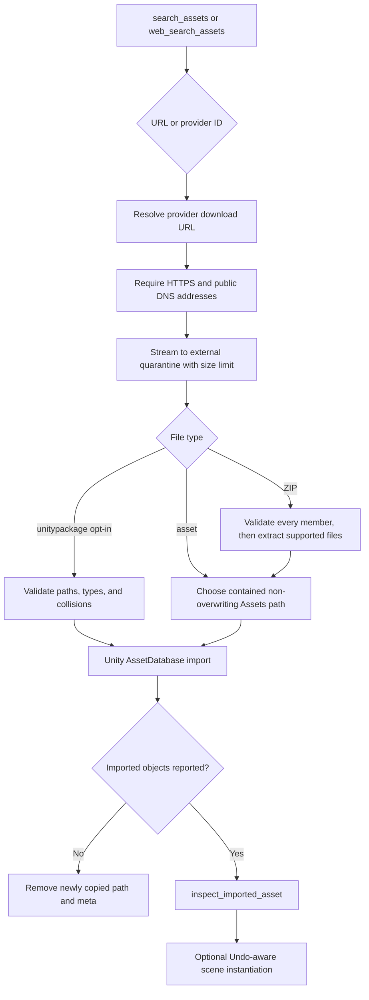

# Asset pipeline

The asset tools do more than copy a URL into `Assets/`. They separate discovery, untrusted network input, quarantine, archive inspection, filesystem placement, Unity import, and post-import verification into explicit stages.

<p align="center">
  
</p>
<p align="center"><em>Untrusted bytes are inspected before they cross into Unity’s live asset database.</em></p>

## End-to-end flow



## Discovery providers

`search_assets` supports:

- **ambientCG:** CC0 materials, textures, environments, and related downloads;
- **Sketchfab:** model metadata and authenticated download resolution;
- **Poly Pizza:** included when `POLY_PIZZA_API_KEY` is configured;
- **direct URL:** an HTTPS query is treated as a direct candidate.

With `source=auto`, ambientCG and Sketchfab run concurrently; Poly Pizza joins when configured. Provider failures become warnings so one unavailable service does not discard successful results from another.

### Sketchfab search caveat

The Sketchfab public search behavior used by this project has been observed to ignore query text and behave like a browse listing. This makes it unsuitable for a specific named character, prop, or vehicle even when the API token is valid.

Use `web_search_assets` for that case. It searches for real Sketchfab model pages through configured SearXNG instances, falls back to DuckDuckGo, extracts the model UID, and returns an ID such as:

```text
sketchfab:<uid>
```

Pass that value as `asset_id` to `download_and_import_asset`. A `SKETCHFAB_API_TOKEN` is still required to resolve the authenticated downloadable archive.

`downloadable_only=true` hides Sketchfab results whose URLs cannot be resolved without a token and reports the hidden count as a warning. Set it to false when discovery without immediate download is useful.

## Accepted inputs

`download_and_import_asset` accepts exactly one of:

- `url`: a direct remote URL;
- `asset_id`: a provider-prefixed ID such as `sketchfab:<uid>` or `ambientcg:<id>`.

`import_local_asset` accepts an existing local file. Local input bypasses remote URL checks but still passes file-type, destination-containment, collision, package, and Unity-import checks.

Supported downloaded asset/companion extensions are:

```text
.fbx .obj .gltf .glb .png .jpg .jpeg .tga .exr .hdr .bin .mtl
```

ZIP is supported as a container. `.bin` and `.mtl` are allowed because non-binary glTF and OBJ assets may depend on them; they are not selected as the primary instantiated model.

`.unitypackage` is denied by default and requires `allow_unitypackage=true`.

## Remote URL defense

Every initial URL and every redirect target is validated before connecting:

- scheme must be HTTPS;
- hostname must be present;
- embedded username/password are rejected;
- DNS must resolve successfully;
- every resolved address must be globally routable;
- at most five redirects are followed manually.

This prevents obvious SSRF paths to loopback, private networks, link-local services, and credential-bearing URLs. Manual redirect handling matters because an initially public URL could otherwise redirect to an internal address after validation.

DNS rebinding cannot be eliminated perfectly by application-level pre-resolution alone. The native bridge remains loopback-only and the downloader should run in a network environment appropriate for untrusted URLs.

## Quarantine and streaming

Remote data is written under `ASSET_CACHE_DIR`, which must resolve outside the Unity project’s `Assets` directory. The default is `<Unity-project>/.visora_cache`; Docker uses `/data/cache` on a named volume.

Downloads stream in fixed-size chunks to an exclusive `.tmp` file:

- `Content-Length` is rejected when already above the limit;
- actual streamed bytes are counted even without a header;
- the default maximum is 250,000,000 bytes;
- the temporary file is atomically renamed only after a complete response;
- partial temporary files are removed on failure.

Staging outside `Assets` prevents Unity from importing an unvalidated partial download.

## ZIP validation

The full archive is validated before extraction begins. Checks include:

- maximum entry count;
- path containment to block Zip Slip;
- symbolic-link rejection;
- per-entry uncompressed size;
- total uncompressed size;
- compression-ratio limit to reduce zip-bomb risk;
- supported extension filtering;
- rejection when no supported file remains.

Dotfiles and `__MACOSX` metadata are skipped. Unsupported provider sidecars are ignored rather than failing an otherwise useful archive. Extraction occurs into a new directory with exclusive file creation; a partial directory is removed if any extraction step fails.

Configuration defaults are documented in [Setup](../SETUP_GUIDE.md#configuration-reference).

## Unity package validation

A `.unitypackage` can contain project code and overwrite existing paths, so its import is opt-in and intentionally restrictive. Before Unity sees it, Visora reads the package pathname entries and requires:

- every path to remain under `Assets`;
- every destination type to be in the normal asset allowlist;
- no destination to already exist;
- at least one supported importable asset.

Scripts, assemblies, arbitrary project settings, unsafe paths, and collisions are rejected by the extension and containment rules. This makes `.unitypackage` support appropriate for narrow asset bundles, not general package installation.

## Destination containment and collisions

`target_folder` may be relative to the Unity project (`Assets/Characters`) or relative to `Assets` (`Characters`). Absolute paths and traversal outside `Assets` are rejected after path resolution.

Existing files are never overwritten. Visora allocates a deterministic suffix:

```text
robot.fbx -> robot-1.fbx -> robot-2.fbx
```

The result returns the actual Unity asset path and a warning about the collision. Callers must use the returned path rather than assuming the requested filename.

## Unity import

After validated content is copied into `Assets`, the backend calls a native asset endpoint or the compatible centralized C# script. Import requests are not replayed after read timeout.

The operation is considered successful only when Unity reports concrete imported objects. “Request completed” with an empty import list becomes a failure. When import fails, Visora removes the newly copied file/directory and its root `.meta` sidecar.

### glTF and GLB

Vanilla Unity does not include a glTF importer. The target project must install one, for example `com.unity.cloud.gltfast`. Without it, a `.gltf` or `.glb` download may exist on disk but cannot become a real Unity model; Visora reports this explicitly rather than treating an empty placeholder as success.

## Post-import verification

Always call `inspect_imported_asset` after import. At minimum verify:

- `asset_type` is a real imported type;
- model geometry exists and `submesh_count` is greater than zero where expected;
- material and texture relationships are plausible;
- ModelImporter rig/Avatar settings match the intended workflow;
- hierarchy warnings are understood.

Only then call `instantiate_scene_asset`. Instantiation is Undo-aware and returns the actual GameObject path and instance ID. A successful import does not automatically create a scene object unless requested.

## Failure and cleanup matrix

| Failure stage | Expected state |
| --- | --- |
| URL/DNS validation | No network download and no Unity project changes |
| Streaming | Partial `.tmp` removed; no Unity project changes |
| Archive validation/extraction | Partial extraction directory removed |
| Destination validation | Quarantined file may remain in cache; `Assets` unchanged |
| Unity import | Newly copied destination and root `.meta` removed |
| Optional instantiation | Imported asset remains; scene object creation reports failure |

The cache is not a permanent source registry. Operators may remove old quarantine downloads when no Visora process is using them.

## Configuration

| Variable | Default | Purpose |
| --- | --- | --- |
| `SKETCHFAB_API_TOKEN` | empty | Resolve Sketchfab downloads |
| `POLY_PIZZA_API_KEY` | empty | Enable Poly Pizza provider |
| `DEFAULT_ASSET_IMPORT_DIR` | `Assets/VisoraDownloads` | Default contained destination |
| `ASSET_DOWNLOAD_TIMEOUT_SECONDS` | `120` | Remote request budget |
| `MAX_ASSET_DOWNLOAD_SIZE_BYTES` | `250000000` | Streamed download ceiling |
| `ASSET_CACHE_DIR` | `.visora_cache` | External quarantine root |
| `MAX_ASSET_ARCHIVE_ENTRIES` | `10000` | ZIP entry ceiling |
| `MAX_ASSET_ARCHIVE_UNCOMPRESSED_SIZE_BYTES` | `1000000000` | Total expanded-size ceiling |
| `MAX_ASSET_ARCHIVE_ENTRY_SIZE_BYTES` | `250000000` | One expanded-entry ceiling |
| `MAX_ASSET_ARCHIVE_COMPRESSION_RATIO` | `100` | Per-entry expansion ratio ceiling |
| `SEARXNG_INSTANCE_URLS` | three public instances | Comma-separated search fallback order |
| `WEB_SEARCH_TIMEOUT_SECONDS` | `10` | Per web-search request budget |

For environment loading behavior and Docker mounts, see [Setup](../SETUP_GUIDE.md). For scene recovery after instantiation, see [State and safety](STATE_AND_SAFETY.md).
