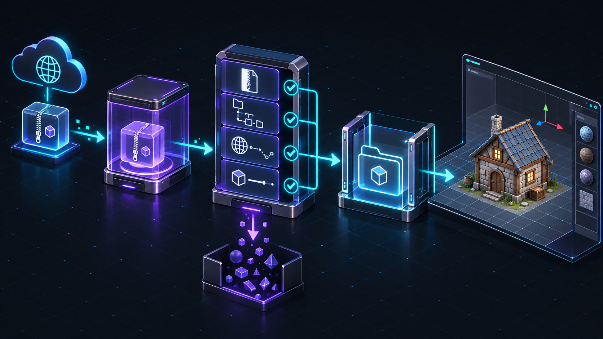
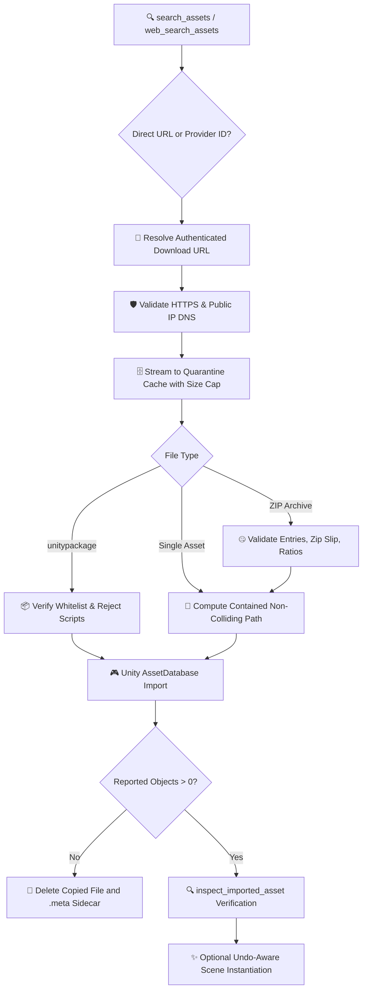

# 📦 Asset Pipeline & Security Boundaries

> Deep architectural guide to 3D asset discovery, remote URL sanitization, anti-SSRF defenses, quarantine extraction, Unity AssetDatabase registration, and post-import verification.

Visora's asset pipeline separates asset acquisition from Unity Editor project storage. Instead of blindly streaming remote bytes directly into `Assets/`, Visora enforces an explicit multi-stage security pipeline: discovery ➔ URL sanitization ➔ quarantine download ➔ archive inspection ➔ path containment ➔ Unity import ➔ post-import verification.

<p align="center">
  
</p>
<p align="center"><em>Untrusted bytes are quarantined and validated before they cross into Unity’s live asset database.</em></p>

---

## 🔄 End-to-End Pipeline Lifecycle



---

## 🌐 3D Asset Discovery Providers

`search_assets` aggregates online CC0 and commercial repositories:
- 🎨 **ambientCG**: CC0 PBR materials, textures, HDRIs, and 3D props.
- 🦊 **Sketchfab**: Broad 3D catalog; requires `SKETCHFAB_API_TOKEN` for download resolution.
- 🍕 **Poly Pizza**: Low-poly CC0/CC-BY assets; active when `POLY_PIZZA_API_KEY` is configured.
- 🔗 **Direct URL**: Direct public HTTPS links to supported 3D models or textures.

> [!TIP]
> **Sketchfab Search Workaround**: Sketchfab's public API search sometimes behaves as a browse listing rather than filtering by keyword. Use `web_search_assets` to search via SearXNG/DuckDuckGo, extracting a verified `sketchfab:<uid>` for `download_and_import_asset`.

---

## 📋 Accepted File Types & Extensions

Visora exclusively admits safe 3D formats and texture companions:

```text
.fbx  .obj  .gltf  .glb  .png  .jpg  .jpeg  .tga  .exr  .hdr  .bin  .mtl
```

- `.bin` and `.mtl` are permitted strictly as auxiliary companions for glTF and OBJ models.
- Executables (`.exe`), scripts (`.cs`, `.py`, `.sh`), and native libraries (`.dll`, `.so`) are **strictly rejected**.
- `.unitypackage` files are rejected by default and require explicit `allow_unitypackage=true`.

---

## 🛡️ Remote URL Defense & Anti-SSRF

Before initiating outbound network requests, every URL and subsequent redirect target is validated:
- 🔒 **Protocol**: Must use `https://`. Unencrypted HTTP is rejected.
- 🚫 **Credentials**: Embedded basic authentication (`user:pass@host`) is denied.
- 🌐 **DNS & IP Routing**: Hostnames are resolved; private RFC1918 addresses (`10.0.0.0/8`, `172.16.0.0/12`, `192.168.0.0/16`), loopback (`127.0.0.1`), link-local (`169.254.0.0/16`), and multicast ranges are blocked.
- 🔀 **Manual Redirects**: At most 5 redirects are followed manually, re-validating the destination IP on each hop.

> [!WARNING]
> This defense effectively mitigates Server-Side Request Forgery (SSRF) and prevents agents from accidentally pinging internal cloud metadata endpoints (`169.254.169.254`) or local services.

---

## 🗄️ Quarantine Staging & Streaming

Downloaded data is written into `ASSET_CACHE_DIR` (default `<project>/.visora_cache`), completely outside Unity's `Assets/` directory:
- Downloads stream in chunks directly to a temporary `.tmp` file.
- Header `Content-Length` and real transferred bytes are counted continuously against `MAX_ASSET_DOWNLOAD_SIZE_BYTES` (default 250 MB).
- The file is atomically renamed only after the entire download completes and hashes verify.
- Incomplete or aborted downloads are immediately deleted.

---

## 🤐 ZIP Archive Inspection & Anti-Zip-Bomb

ZIP archives are analyzed in quarantine before extracting a single file:
- 🚫 **Zip Slip Prevention**: Every target path is checked against destination boundaries (`../` traversal is blocked).
- 🚫 **No Symlinks**: Symbolic links and hard links are rejected.
- 💣 **Anti-Zip-Bomb**: Total uncompressed size ceiling (1 GB) and per-entry expansion ratio limits (maximum 100:1) prevent decompression bombs.
- 🧹 **Metadata Stripping**: `__MACOSX` folders and `.DS_Store` files are skipped automatically.

---

## 📦 Unity Package (.unitypackage) Restricted Import

Because `.unitypackage` files can execute code upon import, Visora treats them with extreme caution:
- Requires explicit `allow_unitypackage=true`.
- The archive is unpacked and inspected in quarantine.
- If it contains any script (`.cs`), assembly (`.dll`), or attempts to overwrite existing files, the entire package is **rejected immediately**.

---

## 📁 Path Containment & Collision Avoidance

- `target_folder` is confined strictly to the project's `Assets/` hierarchy.
- **Collision Protection**: Existing files are never overwritten. A deterministic incremental suffix is applied:
  ```text
  hero.fbx ➔ hero-1.fbx ➔ hero-2.fbx
  ```
- The actual assigned path is returned in `asset_path` alongside a diagnostic warning.

---

## 🎮 Unity AssetDatabase Import & Cleanup

Once validated files are moved into `Assets/`, Unity's `AssetDatabase` is instructed to import the asset:
- Read timeouts are never replayed automatically.
- Import is verified: Unity must report concrete imported object paths.
- If Unity returns zero imported objects, Visora removes the copied files and any generated `.meta` sidecars automatically.

> [!IMPORTANT]
> **glTF / GLB Requirement**: Vanilla Unity lacks a built-in glTF importer. Ensure a runtime importer such as `com.unity.cloud.gltfast` is installed in the Unity project before attempting to import `.gltf` or `.glb` files.

---

## 🔍 Post-Import Verification & Scene Instantiation

Always call `inspect_imported_asset` following an import to verify:
1. Model geometry contains valid vertices and submeshes (`submesh_count > 0`).
2. Texture and material assignments resolved cleanly without missing shader errors.
3. Rig animation import settings (Humanoid vs Generic) match intentions.

Once verified, instantiate into the scene using `instantiate_scene_asset`. Instantiation creates an Undo record and returns the instance ID and hierarchy path.

---

## 🧹 Failure & Automatic Cleanup Matrix

| Stage | Failure Reason | State on Disk |
| :--- | :--- | :--- |
| **URL Validation** | Private IP / SSRF attempt | Zero files written; no network download |
| **Streaming** | Size cap exceeded / connection drop | Quarantined `.tmp` file deleted immediately |
| **Archive Scan** | Zip Slip / Zip Bomb / Invalid format | Extraction folder deleted; cache kept clean |
| **Path Placement** | Path traversal outside `Assets/` | Quarantined file remains in cache; `Assets/` clean |
| **Unity Import** | Importer error / unreadable format | Copied assets and `.meta` files completely removed |
| **Instantiation** | Missing parent transform | Imported asset remains; scene stays clean |

---

## ⚙️ Security Configuration Settings

| Setting | Default | Description |
| :--- | :---: | :--- |
| `MAX_ASSET_DOWNLOAD_SIZE_BYTES` | `250 MB` | Hard limit for streamed network downloads |
| `MAX_ASSET_ARCHIVE_ENTRIES` | `10,000` | Maximum number of files permitted inside a ZIP |
| `MAX_ASSET_ARCHIVE_UNCOMPRESSED_SIZE_BYTES` | `1 GB` | Maximum decompressed extraction limit |
| `MAX_ASSET_ARCHIVE_COMPRESSION_RATIO` | `100` | Maximum allowed compression expansion ratio |
| `ASSET_CACHE_DIR` | `.visora_cache` | Quarantined staging directory outside `Assets/` |
| `DEFAULT_ASSET_IMPORT_DIR` | `Assets/VisoraDownloads` | Default project destination folder |

