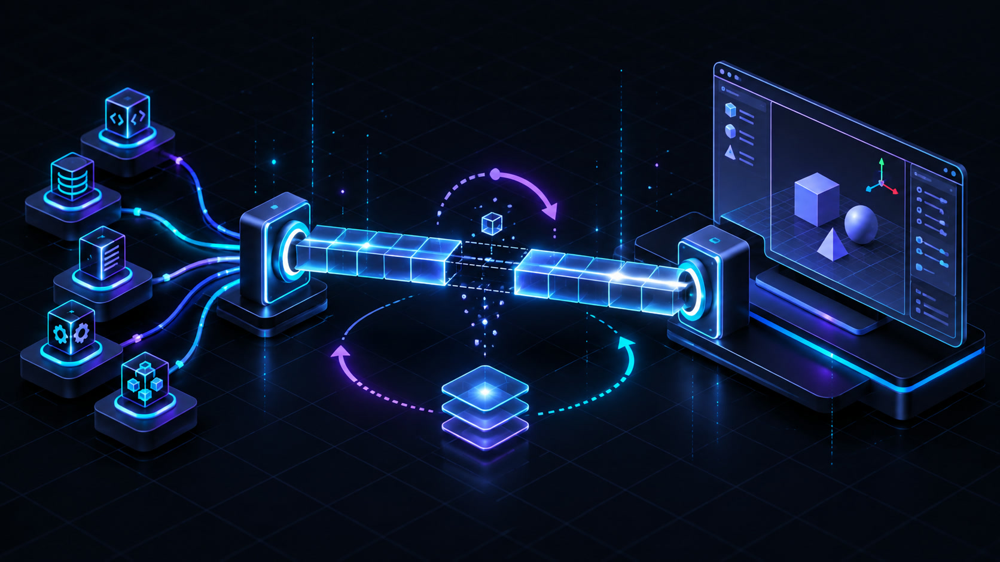

# Bridge and failure semantics

`backend.bridge.UnityBridge` is the only general-purpose HTTP client for Unity. It hides port discovery and transport differences from tools while preserving enough detail for an agent to decide whether to retry, repair configuration, or change project state.

<p align="center">
  
</p>
<p align="center"><em>Discovery finds the route; recovery keeps transient Unity reloads from becoming false hard failures.</em></p>

## Connection model

The bridge base URL does not include the port. Candidate ports are assembled in this order, with duplicates removed:

1. the last port that successfully served a request;
2. `UNITY_BRIDGE_PORT`;
3. `UNITY_BRIDGE_FALLBACK_PORT`;
4. each value in `UNITY_BRIDGE_PORTS_TO_SCAN`.

The active port is cached. The last-good port is stored separately so a domain reload can clear the active selection without losing the most likely reconnect target.

Each candidate is identified through `GET /api/ping`. A successful HTTP status with an empty or malformed body during domain reload is remembered as an unidentified live port; the client does not guess the flavor and permanently disable native features.

## Bridge mode and flavor selection

`UNITY_BRIDGE_MODE` accepts:

| Mode | Accepted bridge | Selection behavior |
| --- | --- | --- |
| `legacy` | Any responding bridge not identified as `visora-native` | First match; this is the Python default |
| `native` | Only `flavor: visora-native` | First native match |
| `auto` | Either | Returns the first legacy match; remembers native as a fallback |

Invalid configuration values normalize to `auto`. Use an explicit mode in stable environments; it makes accidental connection to the wrong Editor or bridge flavor easier to diagnose.

## Capability negotiation

Native bridge features are read from `GET /api/visora/info` and cached as a `frozenset`. Version-sensitive and native-only tool paths should be chosen only when their named feature is advertised. Stable compatibility routes may dispatch from the verified native flavor through `execute_capability`.

This distinction prevents three problems:

- an older native package may use the same route with different semantics;
- bridge flavor alone does not prove a particular endpoint exists;
- caching an empty feature set after one transient failure would disable optimized paths for the rest of the process.

For that reason, failed or malformed capability probes are not cached. Legacy mode receives a synthesized bridge-info response containing only the stable compatibility capabilities.

## Request policy

Healthy requests have no preflight state probe. They perform one HTTP request.

The generic request path then follows these rules:

| Observation | Behavior | Reason |
| --- | --- | --- |
| 2xx with usable JSON-shaped body | Return response and remember the port | Normal success |
| 4xx/5xx | Raise `BridgeHTTPError` immediately | The peer answered; changing ports is unlikely to help |
| Connect/network failure before a known connection | Retry with backoff and rescan candidates | The selected port may be stale |
| Connection drop after a known-good request | Enter editor-recovery loop, then replay once | Common during Unity domain reload |
| 2xx with empty/non-JSON body on a recoverable request | Treat as probable mid-reload, recover, replay once | Unity listener can reappear before managed JSON is ready |
| Read timeout | Raise `BridgeTimeoutError`; do not replay | The operation may already have mutated Unity and a replay can apply it twice |

The last rule is critical. A timeout does not mean Unity did nothing. Methods that can mutate state explicitly pass `retry_on_timeout=False` when necessary. New bridge calls must classify replay safety instead of accepting retries mechanically.

## Domain-reload recovery

After a real request observes a connection drop or reload-shaped response, recovery polls `/api/editor/state` on the last-good port at a short interval. It does not recursively call the normal request path.

Recovery tracks these states:

- `compiling`: `isCompiling` is true;
- `updating`: `isUpdating` is true, commonly during asset import;
- `reloading`: the last-good bridge is temporarily unavailable or returns an unusable body;
- `unreachable`: no working bridge was ever established.

After repeated failures on the known port, recovery performs at most one full candidate rescan. If the editor does not become idle before `UNITY_BRIDGE_READY_WAIT_SECONDS`, it raises `BridgeBusyError` with a state and suggested retry delay.

State, Play Mode, compilation, health, and queue polling use `recover=False` where their own loop already owns transient handling. This avoids nested waits and lets those calls remain responsive while Unity is changing state.

## Typed exception taxonomy

| Exception | Meaning | Typical caller action |
| --- | --- | --- |
| `BridgeConnectionError` | No matching bridge or request failed across candidates | Start Unity, enable the bridge, check mode/ports/firewall |
| `BridgeTimeoutError` | Request, wait, or ticket operation exceeded its budget | Inspect Unity state and operation side effects before retrying |
| `BridgeHTTPError` | Bridge returned a non-success HTTP status | Read status/body; fix request or Unity-side failure |
| `BridgeProtocolError` | HTTP succeeded but body was empty, non-JSON, or not an object | Treat as reload only where recovery does; otherwise inspect bridge compatibility |
| `BridgeBusyError` | Unity did not settle after a transient failure | Honor `retry_after_seconds`, then retry if `retryable` |
| `BridgeExecutionError` | Dynamic compilation or Unity execution failed | Read compiler/runtime diagnostics and fix code/project state |
| `BridgeStateError` | Operation is invalid in current editor state | Enter the required Edit/Play Mode or wait for idle |

Tool modules catch bridge errors and return Pydantic failures rather than leaking exceptions through MCP. `backend.tools.errors.bridge_error()` maps `BridgeBusyError` to:

```json
{
  "success": false,
  "error": "Unity Editor is compiling scripts...",
  "retryable": true,
  "unity_state": "compiling",
  "retry_after_seconds": 3.0
}
```

Other errors remain non-retryable unless a tool has stronger domain knowledge.

## Queue semantics

Long-running Unity work may return a ticket. `check_ticket_status` can perform one read or poll until a terminal state:

- `completed`: successful result;
- `failed`: failure and Unity error;
- `cancelled`: terminal failure;
- other values such as `pending` or `running`: non-terminal successful status read;
- local polling timeout: `success=false`, `status=timeout`.

Transient polling exceptions are retried until the caller’s polling deadline. The native bridge also exposes cancellation internally, although cancellation is not currently a public MCP tool.

## Timeout settings

| Setting | Default | Applies to |
| --- | ---: | --- |
| `UNITY_BRIDGE_TIMEOUT_SECONDS` | 10 s | General HTTP client requests |
| `UNITY_BRIDGE_PING_TIMEOUT_SECONDS` | 2 s | Per-port discovery probes |
| `UNITY_BRIDGE_EXECUTION_TIMEOUT_SECONDS` | 60 s | Dynamic C# execution request and Unity execution budget |
| `UNITY_BRIDGE_STATE_PROBE_TIMEOUT_SECONDS` | 2 s | One direct recovery state probe |
| `UNITY_BRIDGE_READY_WAIT_SECONDS` | 8 s | Total reactive reload-recovery wait |
| `UNITY_BRIDGE_MAX_RETRIES` | 2 | General attempts after the first, where replay is allowed |
| `UNITY_BRIDGE_RETRY_BACKOFF` | 0.5 s | Linear attempt backoff base |

Tool-specific polling and capture deadlines are supplied as tool parameters or calculated from frame count and interval. Do not raise the global timeout to hide a slow workflow; first determine whether the operation should use a queue, a native sequence endpoint, or a larger explicit tool budget.

## Native HTTP boundary

The bundled server listens only on:

```text
http://127.0.0.1:<port>/
http://localhost:<port>/
```

It has no authentication layer. Loopback binding is therefore part of the security design. If a container must reach Unity, prefer the documented host networking configuration; do not change the Unity package to bind to all interfaces casually.

HTTP request handlers run on worker threads. Unity API calls must be dispatched to `MainThreadDispatcher`. Routines that span editor frames use the stepped dispatcher, which serializes them to protect temporary global render and animation state.

## External compatibility boundary

Visora maintains compatibility with the external AnkleBreaker HTTP/JSON contract. That is the only intended backward-compatibility layer. Python modules, functions, and imports are changed directly without legacy aliases; every internal caller and test must move to the canonical interface together.

## Diagnostic checklist

When a bridge call fails:

1. Run `get_bridge_status(scan_all_ports=true)`.
2. Confirm that its active port matches the bridge shown by the Unity monitor and that `UNITY_BRIDGE_MODE` is explicit. The current MCP status schema does not expose the detected flavor directly.
3. Run `get_editor_state(wait=true)` if Unity is compiling or importing.
4. Inspect `retryable`, `unity_state`, and `retry_after_seconds` rather than parsing the error string.
5. For a read timeout after mutation, inspect the scene or asset before replaying the operation.
6. For native feature failures, inspect `GET /api/visora/info` locally or check the Unity package version and update the package if the feature is not advertised.
7. Inspect the Unity Console for package compilation errors.

Continue with [State and safety](STATE_AND_SAFETY.md) for mutation recovery and [Setup](../SETUP_GUIDE.md#troubleshooting) for operator-facing recovery.
