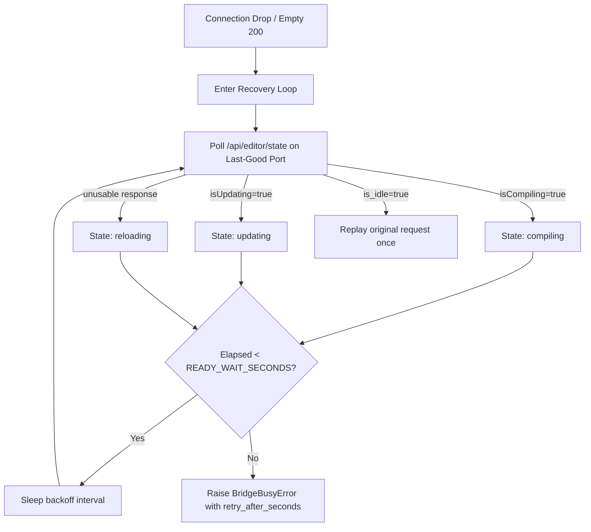

# 🌐 Bridge Transport & Failure Semantics

> Comprehensive guide to HTTP transport discovery, connection caching, domain-reload recovery, typed error taxonomy, and capability negotiation.

The `backend.bridge.UnityBridge` class serves as Visora's unified HTTP client. It isolates low-level port discovery, transient domain-reload drops, and bridge flavor differences from higher-level tools, while surfacing structured diagnostic metadata for agents to decide whether to wait, retry, or adjust scene state.

<p align="center">
  
</p>
<p align="center"><em>Discovery finds the route; recovery keeps transient Unity reloads from becoming false hard failures.</em></p>

---

## 🔌 Connection & Multi-Port Discovery Model

Candidate connection ports are evaluated in the following deterministic sequence (duplicates removed):
1. 🎯 **Last-Good Port**: The most recent port that successfully served a request.
2. 🥇 **Primary Configured Port**: `UNITY_BRIDGE_PORT` (default `7890`).
3. 🥈 **Fallback Configured Port**: `UNITY_BRIDGE_FALLBACK_PORT` (default `7891`).
4. 📋 **Candidate Scan List**: Each candidate port specified in `UNITY_BRIDGE_PORTS_TO_SCAN`.

> [!NOTE]
> The active port is cached during standard operation. If a domain reload disconnects the socket, the active selection is cleared, but the *last-good port* is retained as the first candidate for automatic reconnect.

Candidates are probed via `GET /api/ping`. A 200 OK response with an empty or non-JSON body during reload is recorded as an unidentified live listener, preventing false negatives from permanently locking out native capabilities.

---

## 🏷️ Bridge Flavor Selection & Modes

The `UNITY_BRIDGE_MODE` environment setting controls bridge discovery:

| Mode | Accepted Bridge | Selection Behavior |
| :--- | :--- | :--- |
| `legacy` | Any responding bridge without `flavor: visora-native` | Selects first responding legacy bridge (Python default). |
| `native` | Strictly requires `flavor: visora-native` | Selects first verified native companion package. |
| `auto` | Accepts either | Prefers legacy if both respond; retains native as fallback. |

> [!TIP]
> In production and test environments, specify `native` or `legacy` explicitly rather than relying on `auto`. This makes accidental connections to an unexpected Unity instance immediately obvious.

---

## 🤝 Dynamic Capability Negotiation

When running in native mode, feature flags are queried from `GET /api/visora/info` and cached as a `frozenset`. Tools verify these flags before routing to version-sensitive endpoints:

- 🛡️ **Prevents API Drift**: An older package version may share an endpoint name with divergent parameter semantics.
- 🔍 **Strict Verification**: Flavor alone does not prove the presence of specialized services (e.g. IK solvers, preview comparison).
- 🔄 **Transient Safety**: Failed capability probes are never cached, preventing temporary initialization drops from disabling optimized features permanently.
- 🚫 **Native-Only Capabilities**: Some features have no legacy fallback at all. `prefab_asset_inspection` (`POST /api/visora/prefab/inspect`) is one: emulating Unity's isolated prefab-content lifecycle through arbitrary `execute_code` C# is the one path that could leak a loaded Prefab into the user's project, so a bridge that does not advertise the flag receives an explicit unsupported-capability error instead of an improvised result.
- 🔎 **Override Inspection Is Native-Only Too**: `prefab_override_inspection` (`POST /api/visora/prefab/overrides`) has no `execute_code` fallback either. An improvised C# override walk is exactly what the typed diff replaces, and an ad hoc script carries no read-only guarantee, so a legacy AnkleBreaker bridge receives an explicit unsupported-capability error.

---

## 📡 Request Dispatch & Idempotency Rules

Idempotent and safe requests follow strict dispatch rules:

| Condition | Client Action | Architectural Rationale |
| :--- | :--- | :--- |
| **HTTP 2xx with valid JSON** | Return payload and cache active port | Normal operational success. |
| **HTTP 4xx / 5xx** | Raise `BridgeHTTPError` immediately | Server is alive; re-probing ports will not resolve bad inputs. |
| **Network failure on clean state** | Retry with linear backoff across candidate ports | Port may have rotated or server started on an alternate port. |
| **Connection drop after good state** | Trigger domain-reload recovery loop | Characteristic signature of a Unity script compilation or assembly reload. |
| **HTTP 200 with empty body** | Treat as mid-reload transition; trigger recovery | Unity listener socket re-opens before managed C# runtime settles. |
| **Read Timeout** | Raise `BridgeTimeoutError`; **never blindly replay** | Mutation may have already executed in Unity; replays cause duplicate mutations! |

> [!CAUTION]
> **Never blindly replay timed-out requests!** A read timeout means the socket timed out while waiting for Unity's response. The mutation may have succeeded on the main thread. Tools that mutate state pass `retry_on_timeout=False`.

---

## 🔄 Domain-Reload Auto-Recovery Lifecycle

When a connection drop or transient non-JSON response is detected, Visora initiates a dedicated recovery sequence on the last-good port:



---

## 🧬 Typed Exception Taxonomy

Visora maps transport errors into strongly typed exceptions:

| Exception | Root Cause | Recommended Recovery |
| :--- | :--- | :--- |
| `BridgeConnectionError` | No candidate port answered | Verify Unity is running and Server Monitor is active. |
| `BridgeTimeoutError` | Operation exceeded time budget | Inspect scene state before retrying; do not replay blindly. |
| `BridgeHTTPError` | Endpoint returned 4xx or 5xx | Inspect error message and validate tool input parameters. |
| `BridgeProtocolError` | Malformed or non-JSON payload | Check bridge compatibility and ensure Unity is not mid-reload. |
| `BridgeBusyError` | Unity remained busy past timeout | Honor `retry_after_seconds` hint and retry when idle. |
| `BridgeExecutionError` | Dynamic C# script failed compilation | Check compiler diagnostics in Unity Console. |
| `BridgeStateError` | Action invalid in current state | Transition editor to Edit Mode or Play Mode as required. |

Bridge errors are mapped into standardized MCP results:

```json
{
  "success": false,
  "error": "Unity Editor is compiling scripts...",
  "retryable": true,
  "unity_state": "compiling",
  "retry_after_seconds": 3.0
}
```

---

## 🎟️ Long-Running Task Queue Semantics

Asynchronous Unity tasks return a ticket ID. Tools poll via `check_ticket_status`:
- `completed`: Terminal success; returns structured output.
- `failed`: Terminal failure; contains Unity exception message.
- `cancelled`: Task was aborted before completion.
- `pending` / `running`: Intermediate status; client continues waiting until tool budget expires.

---

## ⏱️ Timeout & Retry Parameters Reference

| Setting | Default | Scope |
| :--- | :---: | :--- |
| `UNITY_BRIDGE_TIMEOUT_SECONDS` | `10 s` | Standard HTTP request timeout |
| `UNITY_BRIDGE_PING_TIMEOUT_SECONDS` | `2 s` | Fast port-scan candidate probe |
| `UNITY_BRIDGE_EXECUTION_TIMEOUT_SECONDS` | `60 s` | Dynamic C# compilation & execution ceiling |
| `UNITY_BRIDGE_STATE_PROBE_TIMEOUT_SECONDS` | `2 s` | Single recovery state probe |
| `UNITY_BRIDGE_READY_WAIT_SECONDS` | `8 s` | Total maximum recovery wait for domain reloads |
| `UNITY_BRIDGE_MAX_RETRIES` | `2` | Retry attempts for safe idempotent requests |
| `UNITY_BRIDGE_RETRY_BACKOFF` | `0.5 s` | Linear backoff multiplier |

---

## 🔒 Security & Loopback Isolation

> [!WARNING]
> The Visora native bridge binds exclusively to loopback interfaces (`127.0.0.1` and `localhost`). It contains no external authentication layer. Never bind this service to public IP addresses or expose it directly to untrusted networks.

---

## 🩺 Maintainer Diagnostic Checklist

When troubleshooting bridge issues:
1. 🔍 Call `get_bridge_status(scan_all_ports=true)` to locate all responsive bridge candidates.
2. 🖥️ Inspect Unity Editor's **Window > Visora > Server Monitor** to confirm port and status.
3. ⏳ If Unity is compiling or updating, call `get_editor_state(wait=true)`.
4. 🩺 Check `retryable`, `unity_state`, and `retry_after_seconds` instead of string matching.
5. ⚠️ Never replay a timed-out mutation without inspecting the scene or operation ID first.
6. 📋 For native feature issues, inspect `GET http://127.0.0.1:<port>/api/visora/info`.

