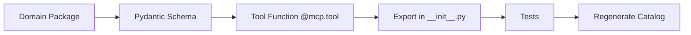

# 🛠️ Backend Development & Contribution Guide

This guide covers local development, architectural conventions, testing standards, and validation gates for the Python MCP server and the bundled Unity package (`com.visora.editor`). Read the [Architecture Overview](README.md) first if you are unfamiliar with the request lifecycle.

<p align="center">
  
</p>
<p align="center"><em>Python and Unity changes have separate gates and converge only after verification.</em></p>

---

## 📋 Prerequisites

| Component | Required Tools | Purpose |
| :--- | :--- | :--- |
| **Python MCP Server** | • Python `3.10+`<br>• `uv` package manager<br>• Git | Fast virtualenv resolution, linting, type-checking, and MCP runtime. |
| **Unity Package** (`com.visora.editor`) | • Unity 6 (`6000.0+`)<br>• .NET SDK (`8.0+`)<br>• Licensed Unity Editor | Standalone Roslyn compile/format gates and EditMode integration tests. |

---

## ⚙️ Environment Setup

Follow these steps to initialize your local development environment:

```bash
# 1. Clone repository
git clone https://github.com/AmaLS367/Visora.git
cd Visora

# 2. Synchronize locked dependencies and virtual environment
uv sync --locked --all-extras

# 3. Create environment configuration
cp .env.example .env
```

> [!TIP]
> Always use `uv` for repository Python commands. The `uv.lock` file is tracked in Git, and CI strictly enforces lockfile synchronization.

### Running the MCP Server Locally

Launch the server using the CLI script:

```bash
uv run visora
```

Or via the explicit Python module entrypoint:

```bash
uv run python -m backend.server
```

> [!NOTE]
> Because MCP operates over `stdio`, manual terminal execution will await JSON-RPC input. To test interactively, connect an MCP client (such as Claude Desktop or Cursor) or write an automated integration test against `backend.server.create_server()`.

---

## 🛡️ Working Tree & Code Rules

To keep the codebase maintainable, reliable, and agent-friendly, adhere to these non-negotiable rules:

* **Strictly NO Internal Backward Compatibility in Python:** Zero tolerance for legacy wrappers, compatibility aliases, deprecated import shims, or fallback arguments inside Python code. When signatures or modules change, update all callers and tests directly.
* **Encapsulate Bridge Transport:** Keep HTTP/JSON details strictly inside `backend.bridge` or narrow tool helpers. Never leak raw `httpx` logic into domain tools.
* **Centralize Settings:** Place all configuration variables in `backend.config.Settings`. Never read environment variables ad hoc.
* **Typed Pydantic Boundaries:** Every MCP tool must take typed inputs and return an explicit Pydantic schema model with `model_dump()`.
* **Centralize Legacy C#:** Place reusable C# fallback scripts in the relevant `scripts.py` module; avoid ad-hoc inline C# snippets.
* **Fail Open & Transparently:** Return explicit error fields and unsupported states. Never return fake success or hide bridge failures.
* **Protect the Scene:** Never save during Play Mode. Always register Undo groups for mutations and restore temporary diagnostic state (e.g., diagnostic cameras, lights, or sampled poses).
* **Compact Diagnostic Payloads:** Keep default responses agent-friendly and bounded (e.g., summarize large vertex arrays or truncate verbose logs).
* **Conventional Commits:** Use clear conventional commit messages (`feat:`, `fix:`, `docs:`, `test:`, `refactor:`).

---

## 🚀 Common Development Paths

### 1️⃣ Add or Change an MCP Tool



1. Identify the target domain package under `backend/tools/` (e.g., `vision/`, `animation/`, `mesh/`, `asset/`).
2. Define or update the typed Pydantic result model under `backend/schemas/`.
3. Implement the tool function with `@mcp.tool()` and an explicit return type annotation.
4. Export the tool in the domain package's `__init__.py` so startup auto-registration picks it up.
5. Add unit, outage, and contract tests under `tests/unit/`.
6. Regenerate the documentation tool catalog:
   ```bash
   uv run python scripts/render_tool_catalog.py
   ```
7. Update workflow guides in `docs/AGENT_WORKFLOWS.md` and tool references in `docs/backend/TOOLS_AND_SCHEMAS.md`.

### 2️⃣ Add a Native Unity Endpoint

1. Define the request/response DTO and register the route in `VisoraHttpRouter.cs`.
2. Dispatch main-thread Unity API work via `MainThreadDispatcher.EnqueueAsync` or `EnqueueSteppedAsync`.
3. Place domain implementation logic in a focused service under `unity-package/Editor/Services/`.
4. Advertise the named capability in `/api/visora/info` (`VisoraInfoService.cs`).
5. Implement the corresponding client method in Python's `UnityBridge` and declare its capability dependency.
6. Provide a legacy C# script fallback if feasible, or return an explicit `501 Not Implemented` with a clear explanation.
7. Add C# EditMode tests (`unity-package/Tests/Editor/`) and Python integration tests, then run the Unity compile gate.

### 3️⃣ Refactor an Internal Python Interface

Update the interface canonically across the entire repository in a single commit. Update all callers, imports, tests, and documentation. Never add deprecation shims or aliases.

---

## 🚦 Validation Gates by Change Type

Select validation gates strictly in proportion to the scope of changes:

| Change Scope | Required Validation Commands | Notes |
| :--- | :--- | :--- |
| **Documentation & Non-functional**<br>*(Markdown, comments, docstrings)* | `uv run ruff format --check .`<br>`uv run python scripts/render_tool_catalog.py --check` | Fast check. Markdown Python code snippets must pass ruff formatting. |
| **Isolated Python Tool**<br>*(Local helper or single tool)* | `uv run ruff check <file>`<br>`uv run ruff format --check <file>`<br>`uv run mypy <file>`<br>`uv run pytest tests/unit/<domain>/` | Token and time-efficient gate targeted to the modified domain. |
| **Core / Architectural Python**<br>*(Config, bridge, multi-tool)* | `uv run ruff check . --fix`<br>`uv run ruff format .`<br>`uv run mypy .`<br>`uv run pytest` | Full Python gate. Verify diff after automated formatting. |
| **Unity Package** (`unity-package/`)<br>*(C# sources, shaders, editor UI)* | `uv run python scripts/check_unity_package.py`<br>`uv run python scripts/check_unity_package.py --format` | Compiles against real Unity managed assemblies using Roslyn analyzers. |
| **Animation Stack Changes**<br>*(Real-time preview, IK, sampling)* | `uv run python scripts/check_unity_tests.py` | Runs real Unity EditMode test suite headless. |

> [!IMPORTANT]
> The C# compile gate uses auto-discovered Unity installations. In custom environments, set `VISORA_UNITY_MANAGED_DIR` pointing to Unity's `Editor/Data/Managed` directory. For EditMode tests, set `VISORA_UNITY_EDITOR` to the Unity executable path.

---

## 📂 Test Suite Structure

```text
tests/
├── unit/
│   ├── core/          # Config, MCP server, schemas, catalog, CLI definitions
│   ├── bridge/        # Transport, retries, discovery, native authoring client
│   ├── vision/        # Camera listing, screenshots, framing, diagnostic lighting
│   ├── animation/     # Skeleton inspection, previews, IK solver, QA scans
│   ├── mesh/          # Diagnostic analysis, bounds, vertex validation
│   └── asset/         # Providers, downloaders, archive extraction, import safety
├── integration/       # End-to-end multi-module workflows and bridge contracts
└── unity-package/Tests/Editor/ # Real Unity EditMode C# service tests
```

> [!TIP]
> When testing configuration defaults, isolate `.env` loading using `monkeypatch` or test fixtures, as Pydantic settings load from the current working directory by default.

---

## 📦 Distribution & Packaging Checks

Project metadata and CLI entrypoints are defined in `pyproject.toml`. Before cutting a release or committing packaging updates:

```bash
# Build source distribution and wheel
uv build

# Validate wheel contents, metadata, and license declarations
uv run python scripts/validate_distribution.py
```

> [!NOTE]
> Python package version (`pyproject.toml`) and Unity package version (`unity-package/package.json`) are maintained independently. Do not assume they increment simultaneously.

---

## 📝 Documentation Checklist

When updating features or behavioral contracts, keep documentation synchronized:

- [ ] [README.md](../../README.md): High-level feature summaries, quick start, badges.
- [ ] [docs/SETUP_GUIDE.md](../SETUP_GUIDE.md): Environment variables, ports, client configs.
- [ ] [docs/AGENT_WORKFLOWS.md](../AGENT_WORKFLOWS.md): Workflow recipes and regenerated MCP catalog.
- [ ] [docs/backend/BRIDGE.md](BRIDGE.md): Port discovery, transport retries, error taxonomy.
- [ ] [docs/backend/TOOLS_AND_SCHEMAS.md](TOOLS_AND_SCHEMAS.md): Public schemas, payload bounds.
- [ ] [docs/backend/STATE_AND_SAFETY.md](STATE_AND_SAFETY.md): Mutation guards, Undo transactions.
- [ ] [docs/backend/ASSET_PIPELINE.md](ASSET_PIPELINE.md): Quarantine extraction, anti-SSRF rules.
- [ ] [docs/CHANGELOG.md](../CHANGELOG.md) & [docs/ROADMAP.md](../ROADMAP.md): Release milestones and logs.

---

## 🔍 Systematic Debugging Workflow

When diagnosing an unexpected tool failure or bridge outage, follow this structured path:

1. **Narrow Reproduction:** Execute the minimal MCP tool call reproducing the issue.
2. **Inspect Structured Output:** Examine `success`, `error`, `warnings`, and `retry_suggested` fields.
3. **Verify Editor State:** Confirm whether Unity is running, current Play/Edit mode, and active port.
4. **Isolate Failure Layer:** Determine if the breakdown occurred in:
   - Tool argument preflight validation;
   - Loopback HTTP transport;
   - Unity C# route matching;
   - MainThreadDispatcher serialization;
   - Unity scene API execution;
   - Result deserialization in Python.
5. **Add Regression Test:** Add a test at the lowest reproducible layer before applying the fix.
6. **Verify State Cleanup:** Ensure no temporary cameras, undo groups, or locked assets remain.
