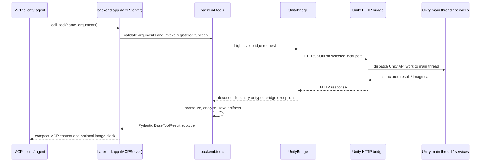

# Backend architecture

The Visora backend is the agent-facing workflow layer. It receives MCP calls over standard input/output, coordinates work against a Unity Editor HTTP bridge, interprets bridge payloads, writes local evidence artifacts when needed, and returns compact Pydantic results.

“Backend” in this documentation includes both sides of that workflow:

- `backend/`: the Python MCP server and HTTP client;
- `unity-package/`: the optional native `com.visora.editor` companion running inside Unity.

The Python package remains the public product boundary. The Unity package accelerates and strengthens that boundary; it does not expose a second MCP API.

<p align="center">
  
</p>
<p align="center"><em>Agent intent enters through MCP; authoritative scene work stays inside Unity.</em></p>

## Runtime topology



There are two independent transports:

1. The MCP client starts and communicates with the Python server over stdio.
2. The Python server communicates with Unity over local HTTP/JSON.

Do not configure an HTTP port for the MCP server. The ports in `UNITY_BRIDGE_*` belong to the Unity bridge only.

## Startup and registration

The console script declared in `pyproject.toml` calls `backend.server:main`.

Startup is intentionally small:

1. `backend.server` loads cached Pydantic settings and configures logging.
2. It imports the tool packages under `backend.tools`.
3. Importing those packages imports each module containing `@mcp.tool()` functions.
4. The decorators register functions on the singleton `backend.app.mcp` server.
5. `mcp.run()` starts the stdio MCP loop.

Tool registration is therefore import-driven. A correctly implemented module that is never imported from its package `__init__.py` will not appear in the MCP catalog. The generated catalog test exists partly to catch this class of error.

`get_settings()` is process-cached, and domain bridge instances are created during imports. Environment or `.env` changes therefore require restarting the MCP server process; changing a file while the process is running does not reconfigure existing clients.

## Python module ownership

| Area | Owns | Must not own |
| --- | --- | --- |
| `backend/app.py` | MCP server instance, agent instructions, response/schema compaction | Unity-specific workflow logic |
| `backend/server.py` | process entrypoint, logging setup, registration imports | tool implementations |
| `backend/config.py` | all environment-backed settings and normalization | ad hoc module-level environment reads |
| `backend/bridge/` | port discovery, HTTP, retry/recovery, bridge flavor and capabilities, typed transport errors | domain interpretation such as mesh classification |
| `backend/tools/bridge/` | agent-facing health and task-ticket tools | raw transport mechanics |
| `backend/tools/scene/` | editor state, Play Mode, save rules, Undo-aware generic transactions | asset or animation-specific policies |
| `backend/tools/vision/` | camera queries, capture, image analysis, MP4 encoding, artifacts | arbitrary scene authoring |
| `backend/tools/animation/` | clip, skeleton, preview, authoring, rig, contact, IK, gaze, and temporal QA workflows | generic HTTP behavior |
| `backend/tools/mesh/` | raw mesh diagnostic interpretation and issue classification | material or rig mutation |
| `backend/tools/asset/` | provider search, secure staging, Unity import, inspection, instantiation | bridge discovery |
| `backend/schemas/` | public result vocabulary and nested typed records | HTTP requests or filesystem side effects |

Reusable C# snippets for legacy execution live in narrow `scripts.py` modules. A tool should not duplicate a raw snippet already represented there.

## Unity package ownership

| Area | Responsibility |
| --- | --- |
| `Editor/Core/VisoraServer.cs` | Loopback-only `HttpListener` lifecycle and assembly-reload restart |
| `Editor/Core/VisoraHttpRouter.cs` | HTTP route matching, request DTOs, JSON responses, advertised capabilities |
| `Editor/Core/MainThreadDispatcher.cs` | Moving Unity API work from HTTP worker threads to the Editor main thread |
| `Editor/Core/VisoraSettings.cs` | EditorPrefs-backed port, auto-start, and verbose-log settings |
| `Editor/Services/` | Camera, diagnostics, queue, transaction, asset, animation, IK, and authoring implementations |
| `Tests/Editor/` | Unity EditMode tests against production services |

Unity APIs are generally main-thread-bound. The HTTP listener accepts work on background tasks, but the router must dispatch Unity API access through `MainThreadDispatcher`. Time-based routines are stepped on `EditorApplication.update`; only one such routine runs at a time because concurrent routines could snapshot and restore each other’s temporary global state incorrectly.

## Request lifecycle

### 1. MCP validation

The MCP framework derives an input schema from the Python function signature. Parameters are validated before the function runs. Public tools declare explicit return types derived from `BaseToolResult`.

### 2. Tool preflight

The tool validates domain conditions that HTTP cannot express: Edit Mode requirements, clip paths, camera dimensions, frame budgets, asset destinations, or required native capabilities.

### 3. Transport selection

The shared `UnityBridge` selects a configured port and bridge flavor. A tool normally calls `execute_capability(legacy_code, native_path=..., native_payload=...)`:

- native bridge with a supplied native route: send typed JSON directly;
- legacy bridge: compile and execute the centralized C# statement body;
- native-only workflow: reject explicitly when the feature is not advertised.

Capability checks are separate from flavor checks. Stable core routes dispatch by flavor, while version-sensitive and advanced workflows require an advertised feature before selecting the optimized or native-only path. A new tool must decide explicitly which rule applies.

### 4. Unity execution

The native router deserializes request DTOs, dispatches Unity API work to the main thread, and serializes a JSON object. Legacy mode wraps the snippet’s own result inside the executor’s outer execution result; domain parsers unwrap that layer before reading operation success.

### 5. Interpretation

Tool code translates raw keys, bounds potentially large arrays, classifies diagnostics, and accumulates warnings. Known vocabulary is represented by typed fields. Unexpected external values degrade to documented fallbacks with warnings where preserving the successful diagnostic is safer than rejecting the whole response.

### 6. Evidence and result

Visual tools may write PNG, contact-sheet, MP4, or preview-record artifacts under `artifacts/`. The tool returns an absolute artifact path and may additionally return an MCP image block. `backend.app.VisoraMCPServer` compacts the final wire result by default.

## Shared result invariant

Every public result inherits:

```python
class BaseToolResult(RetryHint):
    success: bool
    error: str | None = None

class RetryHint(BaseModel):
    retryable: bool = False
    unity_state: str | None = None
    retry_after_seconds: float | None = None
```

Additional data and warnings are tool-specific. A caller should interpret the envelope as follows:

- `success=true`: read data and warnings; verify the domain outcome.
- `success=false`, `retryable=true`: Unity was transiently compiling, importing, or reloading; wait as suggested and retry.
- `success=false`, `retryable=false`: change configuration, input, or project state before retrying.

“Unreachable” is intentionally not marked retryable. This prevents an agent from looping forever when Unity is not running.

## Shared instances and patch points

Each tool package exposes a long-lived `UnityBridge` instance from its `common.py` or health module. The async HTTP client, active port, last-good port, flavor, and supported features are therefore cached across calls in that process.

Some tool modules deliberately call through the package attribute, for example `backend.tools.animation.bridge`, rather than retaining a copied module binding. This keeps the active bridge replaceable in tests and centralizes state for the domain package. When adding a tool, follow the existing package pattern instead of constructing a new `UnityBridge` per call.

## Native and legacy behavior

| Property | Native `com.visora.editor` | Legacy AnkleBreaker |
| --- | --- | --- |
| Selection | `UNITY_BRIDGE_MODE=native` | default `legacy` |
| Discovery identity | `flavor: visora-native` | missing/native-different flavor treated as legacy |
| High-level endpoints | Yes, under `/api/visora/*` | No |
| Compatible executor | Yes | Yes |
| Capability advertisement | `/api/visora/info` | synthesized core list |
| Sequence capture | Native single-request routines | compatible or per-frame fallback depending on workflow |
| Minimum Unity version | Unity 6 from package manifest | determined by AnkleBreaker installation |

`auto` is intended for mixed installations and prefers legacy when both a legacy and native bridge respond. This is current behavior, not a recommendation to run both.

## Artifact ownership

Artifacts are relative to the Python process working directory:

- `artifacts/screenshots/`: screenshots and inspection contact sheets;
- `artifacts/comparisons/`: visual diff images;
- `artifacts/frames/`: video frame images and contact sheets;
- `artifacts/visora-video-*.mp4`: general video captures;
- `artifacts/animation_previews/<preview_id>/`: key frames, contact sheet, MP4, and atomic `record.json`.

Full-resolution data lives at the returned path. Inline images are downscaled according to `VISION_INLINE_MAX_DIMENSION`; MP4 base64 is opt-in. Artifact cleanup is currently an operator responsibility except for internal preview pruning helpers.

## Further reading

- [Bridge and failure semantics](BRIDGE.md)
- [Tools and schemas](TOOLS_AND_SCHEMAS.md)
- [State and safety](STATE_AND_SAFETY.md)
- [Asset pipeline](ASSET_PIPELINE.md)
- [Backend development](DEVELOPMENT.md)
- [Agent workflows](../AGENT_WORKFLOWS.md)
