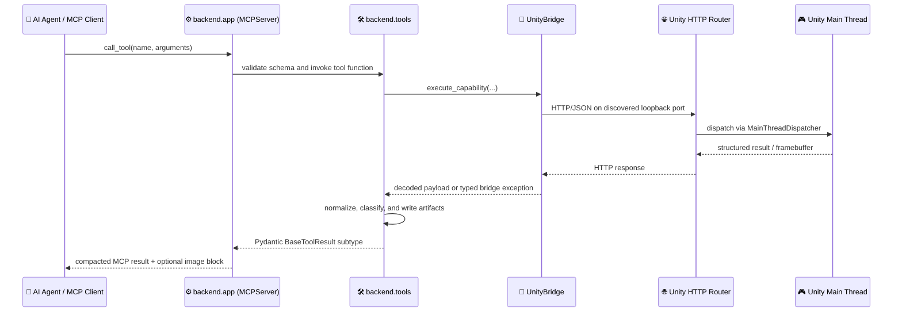

# 🏗️ Visora Backend Architecture

> Deep architectural reference detailing runtime boundaries, process topologies, module ownership, and the request lifecycle between AI agents, the Python MCP server, and Unity Editor.

The Visora backend functions as the high-level, agent-facing workflow layer. It accepts incoming Model Context Protocol (MCP) tool invocations over standard I/O (`stdio`), dispatches structured operations to a local Unity Editor HTTP bridge, parses and normalizes editor telemetry, persists visual and diagnostic artifacts, and yields compact, validated Pydantic responses.

---

## 🌐 Runtime Topology & Process Boundaries

Visora strictly distinguishes between two independent communication layers:
1. **Agent Transport (MCP over `stdio`)**: The AI agent / MCP host spawns and talks to `visora` via standard input and output streams.
2. **Editor Transport (HTTP/JSON on loopback)**: The Python server communicates with Unity Editor's listening bridge over `127.0.0.1`.

<p align="center">
  
</p>
<p align="center"><em>Agent intent enters through typed MCP; authoritative scene work stays inside Unity.</em></p>



> [!WARNING]
> Do not attempt to bind an external HTTP port to the MCP server. The ports configured in `UNITY_BRIDGE_*` belong strictly to Unity Editor's internal loopback listener.

---

## ⚡ Startup & Tool Registration Mechanics

The console command `visora` (or `python -m backend.server`) executes `backend.server:main`.

Startup executes sequentially:
1. ⚙️ **Settings Initialization**: `backend.server` loads cached Pydantic settings (`get_settings()`) and configures structured logging.
2. 📦 **Package Imports**: Imports all tool packages under `backend.tools` (`bridge`, `scene`, `vision`, `animation`, `mesh`, `asset`).
3. 🏷️ **Decorator Registration**: Importing each module triggers `@mcp.tool()` decorators against the singleton `backend.app.mcp` instance.
4. 🚀 **Event Loop Start**: `mcp.run()` initializes the stdio JSON-RPC loop.

> [!NOTE]
> Tool registration is purely import-driven. Any new tool module must be exposed in its parent package's `__init__.py`, otherwise it will not register with the server.

---

## 📦 Python Module Ownership Matrix

| Module | Core Responsibility | Boundary Constraints |
| :--- | :--- | :--- |
| `backend/app.py` | MCP server instance, agent prompts, response & schema compaction | No Unity-specific business logic |
| `backend/server.py` | Process entrypoint, logging bootstrap, registration imports | No tool implementations |
| `backend/config.py` | Centralized Pydantic settings and validation | No ad-hoc environment parsing |
| `backend/bridge/` | Port discovery, HTTP client, retries, reload recovery, transport errors | No domain-level result classification |
| `backend/tools/bridge/` | Agent-facing bridge status and background task ticketing | No low-level socket handling |
| `backend/tools/scene/` | Editor state, Play Mode management, Undo transactions | No animation or asset-specific policies |
| `backend/tools/vision/` | Camera queries, screenshots, MP4 recording, image diffs | No arbitrary scene mutations |
| `backend/tools/animation/` | Rig inspection, keyframing, preview videos, IK, gaze, and motion QA | No generic HTTP handling |
| `backend/tools/mesh/` | Skinned mesh diagnostics and issue classification | No material or transform mutations |
| `backend/tools/asset/` | 3D asset search, quarantine staging, and Unity import | No bridge transport mechanics |
| `backend/schemas/` | Typed Pydantic result vocabulary and nested models | No filesystem or HTTP side effects |

---

## 🎮 Unity Package Service Responsibilities

When using `com.visora.editor`, responsibility within Unity is partitioned across focused C# services:

| Component | Architecture Responsibility |
| :--- | :--- |
| `Editor/Core/VisoraServer.cs` | Loopback `HttpListener` lifecycle, background threading, and assembly reload restarts |
| `Editor/Core/VisoraHttpRouter.cs` | HTTP route matching, DTO deserialization, JSON responses, and capability flags |
| `Editor/Core/MainThreadDispatcher.cs` | Safe marshaling of incoming HTTP tasks to the Unity Editor main thread |
| `Editor/Core/VisoraSettings.cs` | `EditorPrefs`-backed persistent settings (port, auto-start, logging) |
| `Editor/Services/` | Domain services for cameras, animations, assets, IK solvers, and transactions |
| `Tests/Editor/` | Automated Unity EditMode integration test fixtures |

> [!IMPORTANT]
> Unity APIs are fundamentally main-thread-bound. Incoming HTTP requests accept payloads asynchronously on worker threads, but all scene and asset mutations are dispatched through `MainThreadDispatcher`.

---

## 🔄 End-to-End Request Lifecycle

### 1️⃣ MCP Schema Validation
Parameters are validated against the derived Pydantic schema before the tool body runs, rejecting malformed requests immediately.

### 2️⃣ Tool Preflight
The tool evaluates constraints that cannot be expressed purely through schemas: active Edit Mode requirements, frame rate limits, or required native package capabilities.

### 3️⃣ Transport Selection
`UnityBridge` determines whether to route via high-performance native JSON endpoints (`/api/visora/*`) or via legacy AnkleBreaker C# statement bodies.

### 4️⃣ Unity Main Thread Execution
The request is queued and executed on Unity's main thread, guaranteeing thread safety for transforms, shaders, and animations.

### 5️⃣ Interpretation & Classification
The Python tool unrolls the raw Unity payload, coerces known enumerations, classifies diagnostic anomalies, and compiles actionable warnings.

### 6️⃣ Evidence Artifacts & Compaction
Visual tools write full-resolution PNGs, comparison diffs, or MP4s to `artifacts/`. The MCP response is compacted to conserve the agent's context window.

---

## 📐 Shared Result Invariant & Status Contract

Every public tool returns a model derived from `BaseToolResult`:

```python
class BaseToolResult(RetryHint):
    success: bool
    error: str | None = None


class RetryHint(BaseModel):
    retryable: bool = False
    unity_state: str | None = None
    retry_after_seconds: float | None = None
```

### 🧭 Interpretation Guidelines for Agents

- ✅ `success=true`: The operation succeeded. Inspect returned data, warnings, and artifacts.
- ⏳ `success=false, retryable=true`: Unity is transiently compiling scripts or reloading domain. Wait `retry_after_seconds` and retry.
- ❌ `success=false, retryable=false`: Operational error (invalid arguments, missing object, fatal Avatar blocker). Do not retry without modifying parameters or scene state.

---

## 🔌 Native vs. Legacy Bridge Architecture

| Capability | ⚡ Native `com.visora.editor` | 🔌 Legacy AnkleBreaker |
| :--- | :--- | :--- |
| **Configuration** | `UNITY_BRIDGE_MODE=native` | `UNITY_BRIDGE_MODE=legacy` (default) |
| **Endpoints** | Dedicated typed routes under `/api/visora/*` | Single `/execute` endpoint |
| **Execution** | Pre-compiled C# services | Dynamic C# compilation & execution |
| **High-FPS Capture** | Hardware-clocked native sequence capture | Per-frame polling or compatible routines |
| **Capabilities** | Advertised dynamically via `/api/visora/info` | Fixed synthesized core set |
| **Unity Support** | Unity 6 (`6000.0`)+ | Determined by AnkleBreaker |

---

## 📁 Artifact Storage & Ownership

Generated visual and diagnostic evidence is written to disk relative to the server working directory:

```text
artifacts/
  ├── screenshots/           Single-frame camera renders & contact sheets
  ├── comparisons/           Visual before/after diff images
  ├── frames/                Individual video frame sequences
  ├── visora-video-*.mp4     Assembled MP4 animation captures
  └── animation_previews/    Preview manifests, keyframes, and record.json
```

---

## 📚 Related Architectural Guides

- 🌐 [Bridge & Failure Semantics](BRIDGE.md) — Discovery, retries, and domain reload recovery.
- 📐 [Tools & Schemas](TOOLS_AND_SCHEMAS.md) — Schema design and context compaction rules.
- 🛡️ [State & Safety](STATE_AND_SAFETY.md) — Play Mode invariants and transaction lifecycles.
- 💻 [Backend Development](DEVELOPMENT.md) — Local testing and validation gates.
- 🤖 [Agent Workflows](../AGENT_WORKFLOWS.md) — Task recipes and 46-tool MCP catalog.

