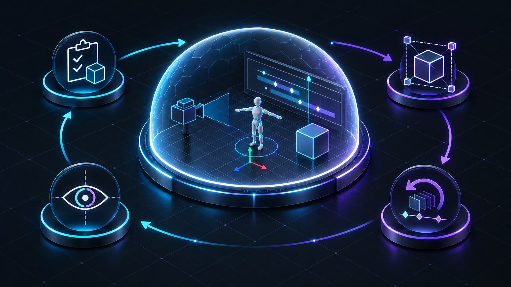

# 🛡️ State Management & Scene Safety

> Architectural policies protecting Unity Editor state: transaction boundaries, Undo groups, Play Mode guards, pre-mutation backups, and evidence verification.

Unity Editor is an intensely stateful execution environment. A single operation can trigger script compilation, domain reloads, asset re-imports, Play Mode physics initialization, scene dirty flags, temporary diagnostic cameras, or modified global render settings. Visora treats state preservation and cleanup as core operational requirements rather than incidental afterthoughts.

<p align="center">
  
</p>
<p align="center"><em>Safety is an unbroken lifecycle: preflight checks, scoped mutation, recovery handles, restoration, and verification.</em></p>

---

## 🛡️ Multi-Layered Safety Model

Safety in Visora is architected across six defensive layers:

1. 🩺 **Preflight Checks**: Verify bridge readiness, editor mode, active script compilation, target paths, and native capabilities.
2. 🎯 **Scoped Scope**: Limit modifications to the minimal required set of GameObjects and utilize unique `operation_id` handles.
3. ↩️ **Recovery Handles**: Instantiate an Undo group, pre-mutation clip backup (`VisoraBackups/`), or scene snapshot before writing.
4. 🚫 **No Blind Replay**: Prevent automatic re-execution when a mutation may already have reached Unity's main thread.
5. 🔄 **Guaranteed Restoration**: Revert temporary cameras, diagnostic lights, and preview poses in strict `finally` clauses.
6. 👁️ **Evidence Verification**: Verify the updated state using structured diagnostics and visual comparisons before persisting.

---

## 🩺 Editor State Lifecycle & Polling

`get_editor_state` continuously tracks Unity's internal operating modes:
- ▶️ **Play & Pause Status**: `isPlaying`, `isPaused`.
- ⚙️ **Compilation & Updates**: `isCompiling` (scripts compiling) and `isUpdating` (assets importing).
- 🟢 **Editor Idle Flag**: `is_idle=true` confirms the editor is ready to receive requests.
- 📁 **Active Scene Details**: Scene name, asset path, loaded scene count, and dirty state.

> [!TIP]
> Always pass `wait=true` when invoking `get_editor_state` prior to a mutation if recent script or asset changes might have triggered compilation.

---

## ⏸️ Edit Mode vs. ▶️ Play Mode Boundaries

Play Mode is not a lightweight visual toggle; entering Play Mode reloads the C# scripting domain, instantiates temporary runtime GameObjects, and resets modified non-serialized state upon exit.

### 🚫 Rules Enforced by Visora

| Action | Allowed in Edit Mode | Allowed in Play Mode | Rationale |
| :--- | :---: | :---: | :--- |
| **AnimationClip Authoring** | ✅ | ❌ | Writing curves in Play Mode would corrupt animation state. |
| **`preview_animation`** | ✅ | ❌ | Samples authoring timeline deterministically in Edit Mode. |
| **`save_scene`** | ✅ | ❌ | Saving in Play Mode serializes runtime instances into disk assets! |
| **Scene Reload from Disk** | ✅ | ❌ | Scene discards in Play Mode trigger runtime state corruption. |
| **`capture_video` (Game Camera)** | ✅ | ✅ | Safely enters Play Mode and automatically restores Edit Mode. |

> [!CAUTION]
> `force_during_play_mode=true` in `save_scene` is an intentional dangerous override. Never use it in autonomous agent workflows unless explicitly ordered to persist runtime modifications.

---

## 🔄 Generic Scene Transactions & Scoped Undo

`safe_transaction` serves as the controlled escape hatch for editor operations that lack a dedicated typed MCP tool:

```text
1. 🩺 Preflight Editor State (verify is_idle)
2. 💾 Optional Pre-Save in Edit Mode
3. ↩️ Register Named Undo Group (Undo.GetCurrentGroup)
4. ⚡ Execute C# Statement Body on Main Thread
5. 🔍 Evaluate Execution Output & Compiler Diagnostics
6. ↩️ Auto-Rollback Undo Group if Errors Occurred
7. 💾 Optional Post-Save in Edit Mode
8. 📊 Return transaction_id, undo_group, and logs
```

### ⚠️ Critical Transaction Boundaries

- Script operations must explicitly register affected Unity objects with `Undo.RecordObject` or `Undo.RegisterCreatedObjectUndo`.
- File writes on disk and external network calls cannot be undone by Unity's Undo stack.
- If an HTTP request times out, Visora does **not** replay the transaction, as Unity may have already executed it.

---

## ↩️ Recovery Handles & Restoration Options

`restore_scene_state` provides two distinct recovery strategies:

| Mechanism | Scope | Risk Profile |
| :--- | :--- | :--- |
| `undo_group` | Reverts all Unity changes recorded under that group ID | Safe and targeted; relies on proper Undo registration. |
| `reload_active_scene=true` | Discards all unsaved changes and reloads scene from disk | Destructive to all unsaved changes across the active scene! |

> [!NOTE]
> Always prefer targeted `undo_group` rollbacks. Scene reloads should be reserved for catastrophic corruption recovery in Edit Mode.

---

## 🎬 Animation Mutation & Automatic Backups

Authoring AnimationClips follows strict safety invariants:
- **Mandatory Edit Mode**: Mutations are rejected if Unity is in Play Mode.
- **Pre-Mutation Snapshots**: Before overwriting keys, Visora duplicates the clip into `Assets/VisoraBackups/<timestamp>_<clip>.anim`.
- **Atomic File Rollback**: Cloned backups can be restored at any time using `restore_animation_clip`.
- **Temporal Verification**: Never verify animations using static screenshots; evaluate motion metrics across time with `preview_animation`.

---

## 👁️ Temporary Preview State Lifecycle

Diagnostic tools may create temporary scene elements (preview cameras, neutral diagnostic light rigs, or sampled poses):
- Stepped native preview routines execute sequentially, preventing concurrent tools from overwriting each other's state.
- All temporary objects (`Visora Preview Camera`, temporary lights) are guaranteed to be destroyed in `finally` blocks.
- Poses sampled via `sample_animation_clip` restore original transforms upon exit (`restore_pose_after=true`).

### 🧩 Isolated Prefab Contents

`inspect_prefab_asset` reads a Prefab through Unity's own prefab-content lifecycle (`PrefabUtility.LoadPrefabContents` / `UnloadPrefabContents`) instead of instantiating it:
- The load and unload are wrapped in `try` / `finally`, so an exception mid-inspection can never leak a hidden prefab content scene for the rest of the Editor session.
- Nothing is created in the user's scene: the active scene, its `isDirty` flag, its root object count, the selection, and any open Prefab Stage are all left untouched (asserted by EditMode fixtures).
- The operation is strictly read-only, so it deliberately opens **no** scene Undo transaction - there is nothing to roll back.

### 🔎 Read-Only Override Inspection

`inspect_prefab_overrides` only reads Unity's override bookkeeping for a Prefab instance in a loaded scene:
- It never applies, reverts, or records overrides, never saves a scene or Prefab, and performs no AssetDatabase mutation.
- Selection, the active scene, scene and object dirty flags, the Undo group, and any open Prefab Stage are untouched. The only objects it creates are `SerializedObject` readers, disposed before returning (asserted by EditMode fixtures across two back-to-back calls).
- Edit Mode is required; a compiling or importing Editor is reported as retryable busy state. An open Prefab Stage with unsaved changes produces a warning, because the diff is computed against the assets as saved.

---

## ⏱️ Idempotency & Replay Decision Matrix

| Request Type | Safe to Retry on Disconnect? | Safe to Retry on Read Timeout? | Policy |
| :--- | :---: | :---: | :--- |
| **Pure Read** (e.g. `list_scene_cameras`, `inspect_prefab_asset`, `inspect_prefab_overrides`) | ✅ Yes | ✅ Yes | Idempotent; safe to repeat across ports. |
| **Write with `operation_id`** | ✅ Yes | ⚠️ Inspect Server Guarantee | Deduplicated by native bridge if supported. |
| **Arbitrary C# (`safe_transaction`)** | ❌ No | ❌ NEVER | Mutation may already have applied in Unity! |
| **Play Mode Transitions** | ❌ No | ❌ No | Poll state with `get_editor_state` instead. |
| **Asset Import & Instantiation** | ❌ No | ❌ NEVER | Re-inspect asset path and scene before retrying. |

---

## 🔍 Verification Patterns by Change Type

| Mutation Type | Mandatory Verification Steps |
| :--- | :--- |
| 📐 **Transform / Material Edit** | Re-query transform state + screenshot (`inspect_scene_visual`) |
| 🎥 **Camera Position Edit** | `diagnose_camera_framing` + `project_world_points` + screenshot |
| 📦 **3D Model Import** | `inspect_imported_asset` (verify geometry and non-empty mesh bounds) |
| 🦴 **Rig / Avatar Setup** | `skeleton_mapper` + `validate_humanoid_avatar` |
| 🎬 **Keyframe / Hold Edit** | `inspect_animation_clip` + `preview_animation` (verify non-static motion) |
| 🦶 **Contact IK Baking** | `analyze_contact_constraints` + `preview_animation` (verify zero sliding) |
| 📐 **Mesh Deformation Fix** | Re-run `skinned_mesh_diagnostics` (verify issue categories resolved) |
