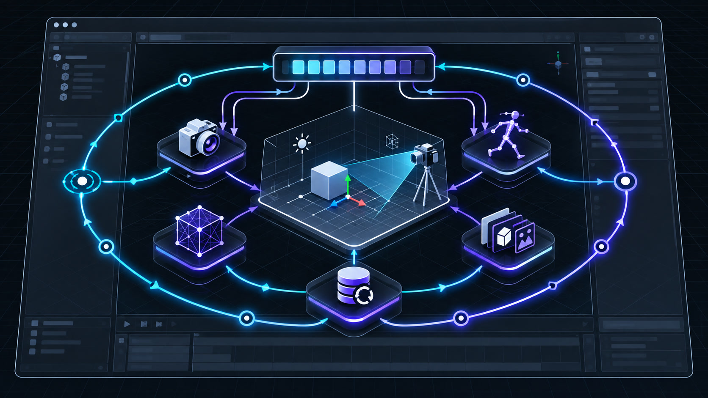
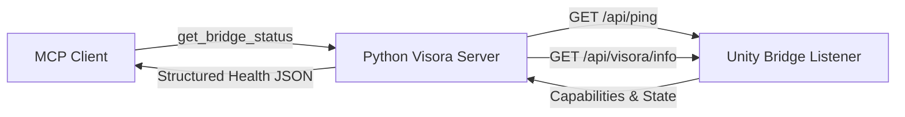

# 🎮 Visora Editor Bridge (`com.visora.editor`)

[-000000?style=flat&logo=unity&logoColor=white)](https://unity.com/)
[](package.json)
[](../LICENSE)
[](https://modelcontextprotocol.io/)

The **Visora Editor Bridge** is the native Unity companion package for the Visora Python MCP server. Running directly inside the Unity Editor, it exposes high-performance loopback HTTP/JSON endpoints, safely schedules work onto the Editor main thread, and provides native camera rendering, animation previews, scene diagnostics, transactions, and asset operations.

> [!NOTE]
> This package is **not** an MCP server by itself. AI agents connect to the Python `visora` server, which in turn orchestrates Unity operations via this bridge.

<p align="center">
  
</p>
<p align="center"><em>The native package keeps HTTP handling local and Unity API work safely serialized on the Editor main thread.</em></p>

---

## 📋 Requirements

| Requirement | Supported Versions | Notes |
| :--- | :--- | :--- |
| **Unity Editor** | `6000.0+` (Unity 6) | Supported as declared by `package.json`. |
| **Visora Python** | `0.1.0+` | Configured with `UNITY_BRIDGE_MODE=native`. |
| **Local Port** | `7890` (default) | Configurable via the Server Monitor window. |

> [!IMPORTANT]
> The bridge version (`1.2.0`) and the Python MCP server version (`0.1.0`) are versioned independently.

---

## 📦 Installation

### Option 1: Unity Package Manager via Git URL (Recommended)

1. In Unity Editor, navigate to **Window > Package Manager**.
2. Click the **`+`** icon in the upper-left corner and select **Add package from git URL…**.
3. Paste the following repository path:

```text
https://github.com/AmaLS367/Visora.git?path=unity-package
```

> [!TIP]
> To pin a specific release version in production, append `#v1.2.0` or a specific Git commit hash to the URL.

---

### Option 2: Local File Path (Development)

For local development or monorepo setups, reference the folder directly or edit your project's `Packages/manifest.json`:

```json
{
  "dependencies": {
    "com.visora.editor": "file:../../Visora/unity-package"
  }
}
```

Wait for Unity to complete package compilation before starting the MCP workflow.

---

## ⚙️ Server Configuration

Open **Window > Visora > Server Monitor** in Unity to inspect and adjust runtime bridge settings:

<p align="center">
  
</p>

| Setting | Default Value | Description |
| :--- | :--- | :--- |
| **Server State** | `Running` | Starts/stops the internal loopback HTTP listener. |
| **Port** | `7890` | Active TCP port. Falls back to port scanning if occupied. |
| **Auto-Start** | `Enabled` | Automatically starts the bridge on Editor launch and domain reload. |
| **Verbose Logging** | `Disabled` | Outputs detailed route execution and payload traces to Unity Console. |

> [!CAUTION]
> The bridge listens exclusively on loopback addresses (`127.0.0.1` and `localhost`). It does not include authentication. **Do not bind to `0.0.0.0` or expose this port to an untrusted public network.**

Configure your Python environment in `.env` to match:

```dotenv
UNITY_BRIDGE_MODE=native
UNITY_BRIDGE_URL=http://127.0.0.1
UNITY_BRIDGE_PORT=7890
```

---

## 🔍 Verification & Health Check

Verify connectivity using standard MCP tools or direct HTTP requests:



### 1. From an MCP Client
```json
// Tool Call
get_bridge_status({"scan_all_ports": true})

// Verify Scene State
get_editor_state({"wait": true})
```

### 2. From Terminal (Direct HTTP)
```bash
# Ping bridge flavor and package version
curl -s http://127.0.0.1:7890/api/ping

# Inspect advertised native capabilities and Unity status
curl -s http://127.0.0.1:7890/api/visora/info | jq .
```

---

## 🏗️ Architecture & Internals

* **`Editor/Core/VisoraServer.cs`:** Manages the `HttpListener` lifecycle, background thread worker pool, and assembly reload recovery.
* **`Editor/Core/VisoraHttpRouter.cs`:** High-speed JSON serialization, endpoint routing, and error formatting.
* **`Editor/Core/MainThreadDispatcher.cs`:** Dispatches asynchronous tasks and stepped multi-frame routines onto `EditorApplication.update`.
* **`Editor/Services/`:** Domain implementations (Camera, Animation, Mesh, Scene, Transaction, and Asset).
* **`Tests/Editor/`:** NUnit integration test suite running in EditMode.

> [!NOTE]
> HTTP handlers run concurrently on background thread pool threads, while the Unity Engine API is strictly single-threaded. All scene manipulation, camera rendering, and object queries are marshaled through `MainThreadDispatcher`.

---

## ⚡ Native Endpoint Capabilities

| Endpoint | Method | Capability Tag | Purpose |
| :--- | :---: | :--- | :--- |
| `/api/ping` | `GET` | *Core* | Health check returning bridge flavor (`visora-native`) and package version. |
| `/api/visora/info` | `GET` | *Core* | Advertises Unity version, Play/Edit mode, and active capability flags. |
| `/api/visora/camera/render` | `POST` | `camera_render` | High-speed viewport and camera frame rendering to PNG/JPEG. |
| `/api/visora/camera/sequence` | `POST` | `camera_sequence_realtime` | Real-time stepped sequence recording across actual Editor frames. |
| `/api/visora/animation/preview-sequence` | `POST` | `animation_preview_sequence` | Deterministic EditMode pose sampling and multi-frame preview. |
| `/api/visora/transaction/begin` | `POST` | `transaction_management` | Opens an Undo group for reversible multi-operation changes. |
| `/api/visora/transaction/commit` | `POST` | `transaction_management` | Closes and records the Undo group. |
| `/api/visora/transaction/rollback` | `POST` | `transaction_management` | Reverts all operations within the active Undo group. |

---

## 🛠️ Package Testing & Validation Gates

Run the automated validation gates from the repository root after making changes to `unity-package/`:

```bash
# 1. Compile C# against real Unity assemblies with Roslyn analyzers
uv run python scripts/check_unity_package.py

# 2. Verify C# code formatting rules
uv run python scripts/check_unity_package.py --format

# 3. Run real Unity EditMode integration tests (headless)
uv run python scripts/check_unity_tests.py
```

* Set `VISORA_UNITY_MANAGED_DIR` if your Unity Managed assemblies reside in a non-standard directory.
* Set `VISORA_UNITY_EDITOR` if your Unity Editor executable is not auto-detected.
* Detailed test execution logs and NUnit XML artifacts are saved to `artifacts/`.

---

## 🔗 Related Documentation

* [Backend Architecture Overview](../docs/backend/README.md)
* [Bridge Protocol & Transport Semantics](../docs/backend/BRIDGE.md)
* [Safety & Transaction Lifecycle](../docs/backend/STATE_AND_SAFETY.md)
* [Complete Setup Guide](../docs/SETUP_GUIDE.md)
